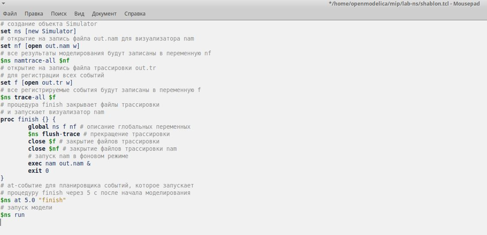
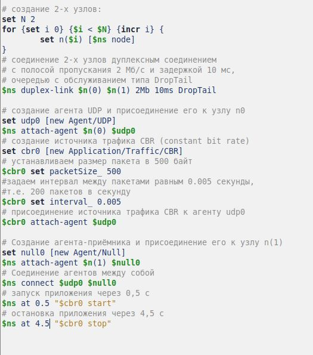
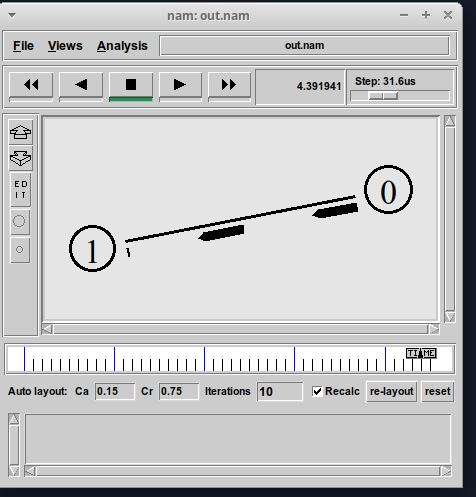
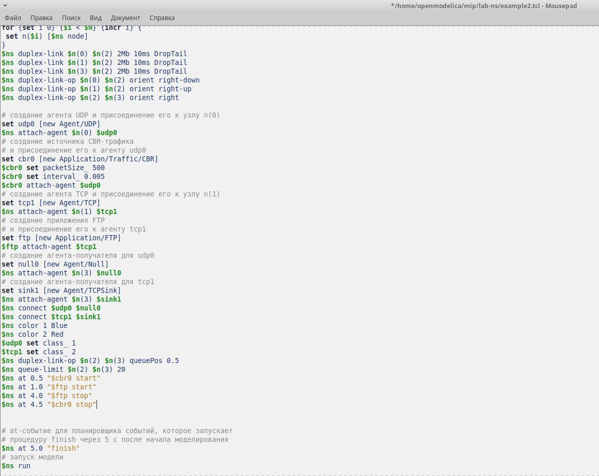
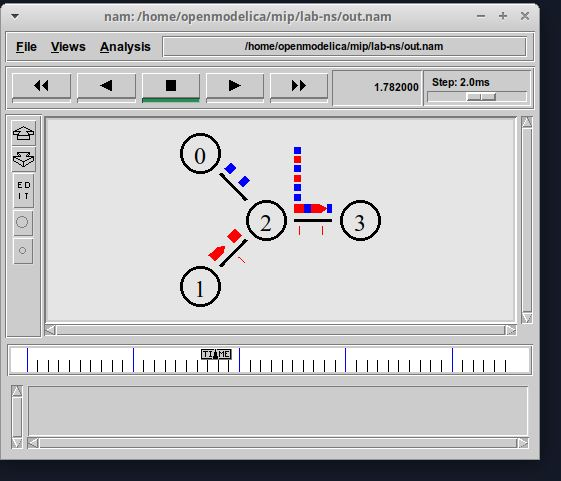
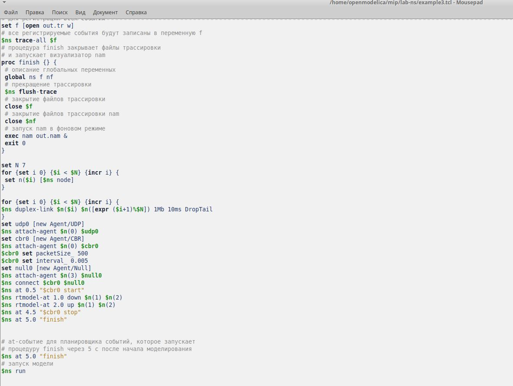
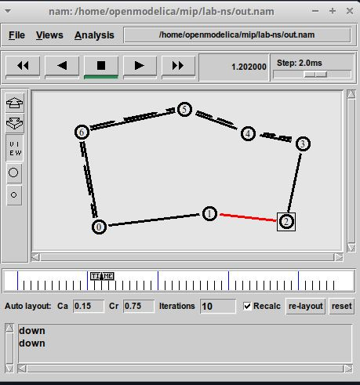
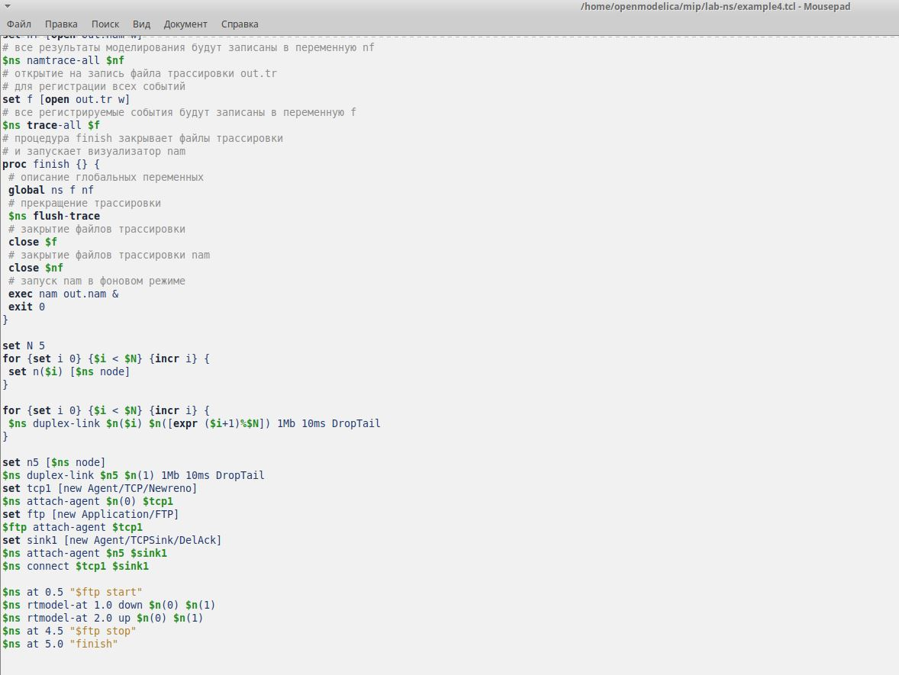
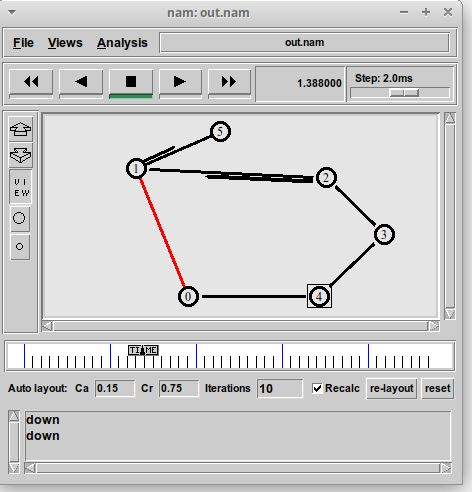

---
## Front matter
lang: ru-RU
title: Отчёт по лабораторной работе 1
subtitle: Простые модели компьютерной сети
author:
  - Сидорова Н.А.
institute:
  - Российский университет дружбы народов, Москва, Россия
  - Объединённый институт ядерных исследований, Дубна, Россия
date: 13 февраля 2025

## i18n babel
babel-lang: russian
babel-otherlangs: english

## Formatting pdf
toc: false
toc-title: Содержание
slide_level: 2
aspectratio: 169
section-titles: true
theme: metropolis
header-includes:
 - \metroset{progressbar=frametitle,sectionpage=progressbar,numbering=fraction}
---

# Информация

## Код шаблона

{#fig:001 width=70%}

## Код первой сети

{#fig:002 width=70%}

## Первая модель

{#fig:003 width=70%}

## Код второй сети

{#fig:004 width=70%}

## Заполненная очередь 

{#fig:005 width=70%}

## Код третьей сети

{#fig:006 width=70%}

## Обход пакетов

{#fig:007 width=70%}

## Код упражнения

{#fig:008 width=70%}

## Моя топология

{#fig:009 width=70%}

:::

