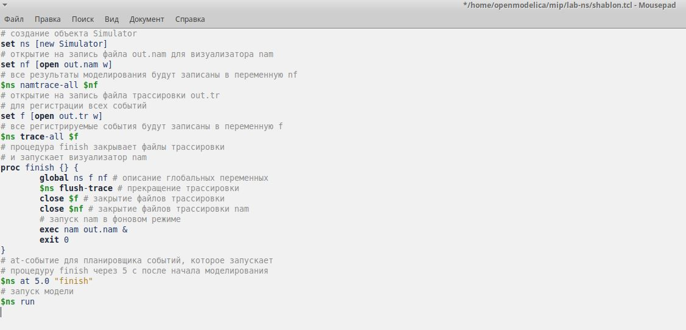
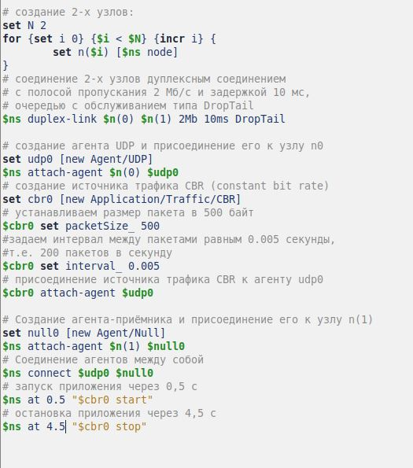
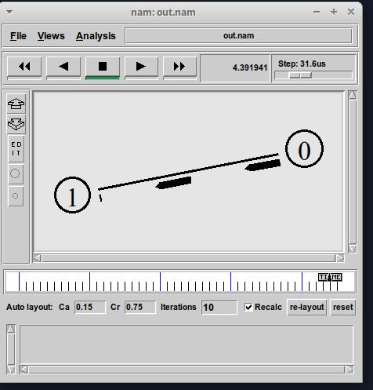
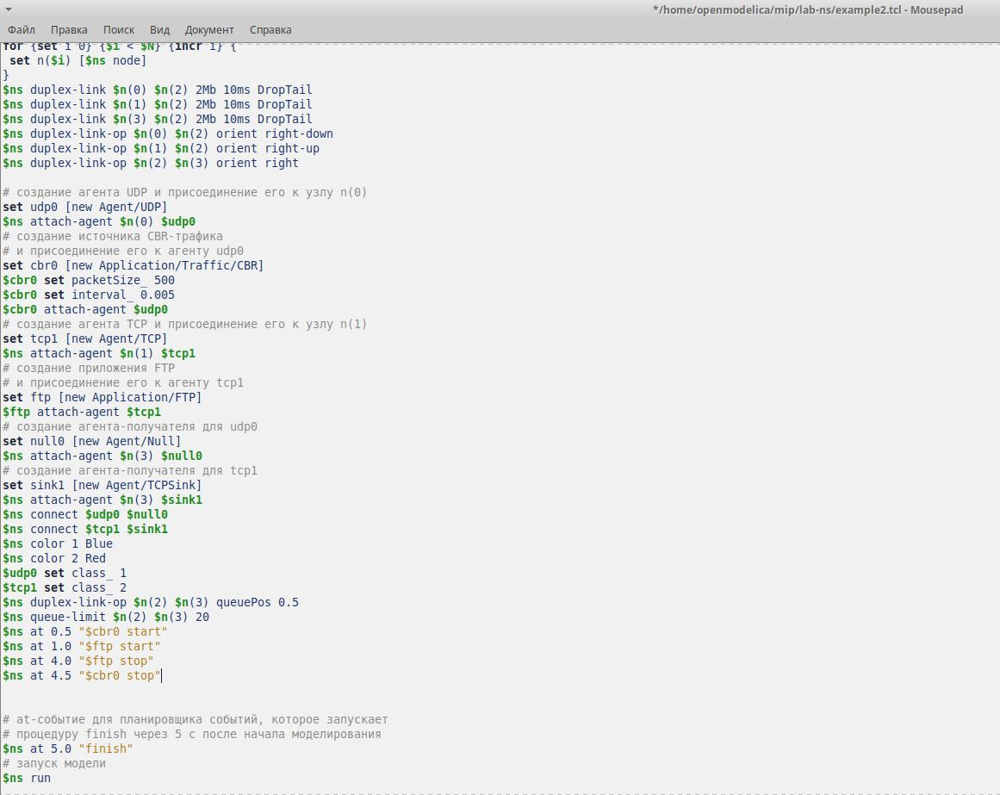
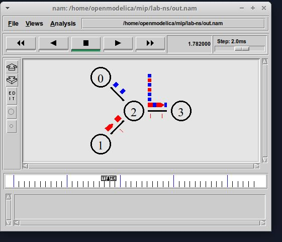
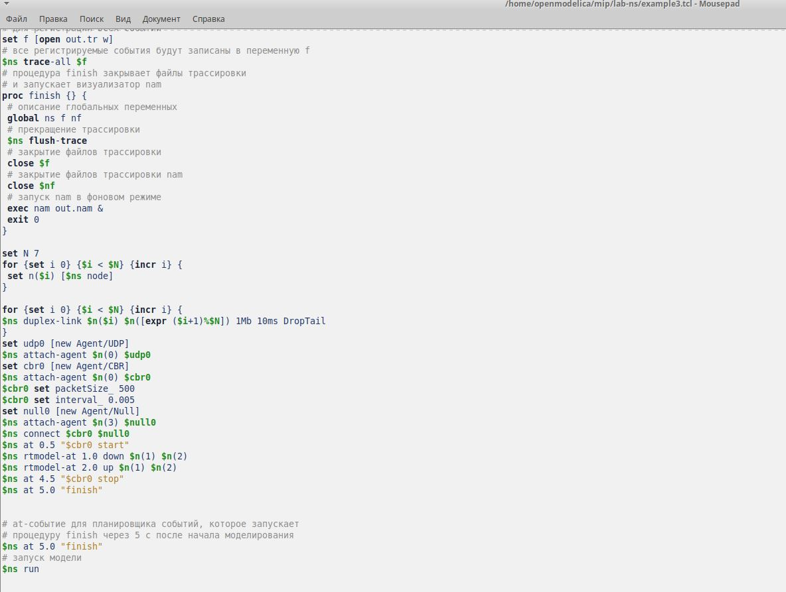
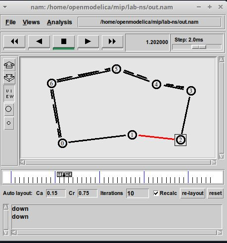
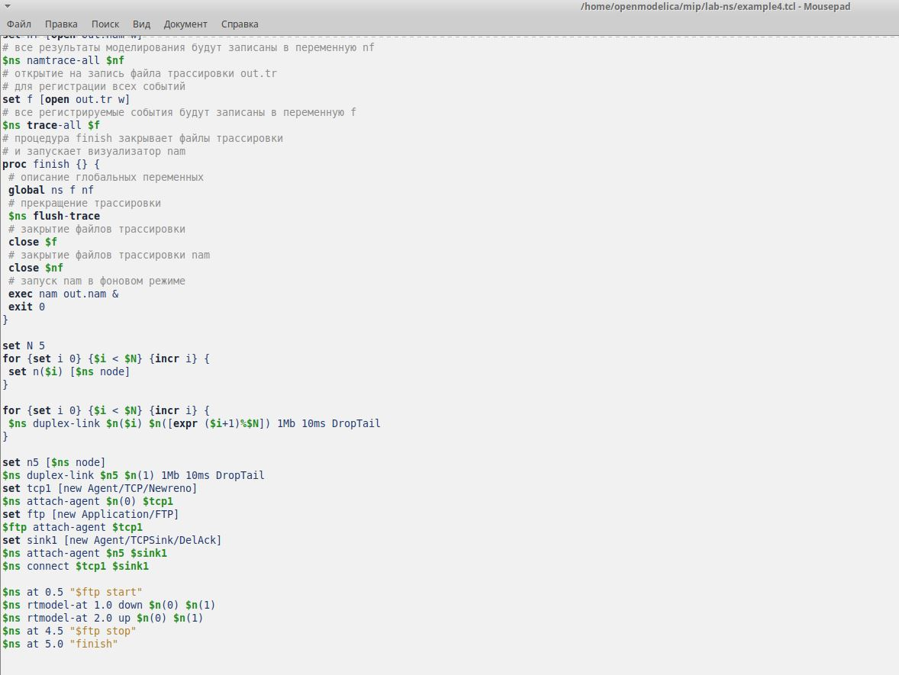
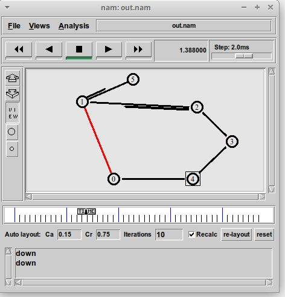

---
## Front matter
title: "Отчёт по лабораторной работе 1"
subtitle: "Простые модели компьютерной сети"
author: "Наталья Андреевна Сидорова"

## Generic otions
lang: ru-RU
toc-title: "Содержание"

## Bibliography
bibliography: bib/cite.bib
csl: pandoc/csl/gost-r-7-0-5-2008-numeric.csl

## Pdf output format
toc: true # Table of contents
toc-depth: 2
lof: true # List of figures
lot: true # List of tables
fontsize: 12pt
linestretch: 1.5
papersize: a4
documentclass: scrreprt
## I18n polyglossia
polyglossia-lang:
  name: russian
  options:
	- spelling=modern
	- babelshorthands=true
polyglossia-otherlangs:
  name: english
## I18n babel
babel-lang: russian
babel-otherlangs: english
## Fonts
mainfont: IBM Plex Serif
romanfont: IBM Plex Serif
sansfont: IBM Plex Sans
monofont: IBM Plex Mono
mathfont: STIX Two Math
mainfontoptions: Ligatures=Common,Ligatures=TeX,Scale=0.94
romanfontoptions: Ligatures=Common,Ligatures=TeX,Scale=0.94
sansfontoptions: Ligatures=Common,Ligatures=TeX,Scale=MatchLowercase,Scale=0.94
monofontoptions: Scale=MatchLowercase,Scale=0.94,FakeStretch=0.9
mathfontoptions:
## Biblatex
biblatex: true
biblio-style: "gost-numeric"
biblatexoptions:
  - parentracker=true
  - backend=biber
  - hyperref=auto
  - language=auto
  - autolang=other*
  - citestyle=gost-numeric
## Pandoc-crossref LaTeX customization
figureTitle: "Рис."
tableTitle: "Таблица"
listingTitle: "Листинг"
lofTitle: "Список иллюстраций"
lotTitle: "Список таблиц"
lolTitle: "Листинги"
## Misc options
indent: true
header-includes:
  - \usepackage{indentfirst}
  - \usepackage{float} # keep figures where there are in the text
  - \floatplacement{figure}{H} # keep figures where there are in the text
---

# Цель работы

Приобретение навыков моделирования сетей передачи данных с помощью средства имитационного моделирования NS-2, а также анализ полученных результатов моделирования.

# Выполнение лабораторной работы

Я создала файл шаблона для построения нескольких моделей компьютерной сети (рис. [-@fig:001]).

{#fig:001 width=70%}

Я создала сеть, состоящую из двух узлов и одного соединения (рис. [-@fig:002]).

{#fig:002 width=70%}

Запустила в программе данную модель (рис. [-@fig:003]).

{#fig:003 width=70%}

Создала усложненную топологию сети с разветвлением. Из за него в приемнике возникает очередь, когда она переполняется то пакеты сбрасываются. (рис. [-@fig:004]).

{#fig:004 width=70%}

Запустила и увидела переполнение очереди (рис. [-@fig:005]).

{#fig:005 width=70%}

Создала кольцевую топологию сети, в ней пакеты идут по кратчайшему пути, если соединение разрывается то пакеты идут по более длинному пути. (рис. [-@fig:006]).

{#fig:006 width=70%}

Запустила и увидела что при разрыве связи пакеты действительно идет по длинному маршруту (рис. [-@fig:007]).

{#fig:007 width=70%}

Сделала упражнение с новыми требованиями (рис. [-@fig:008]).

{#fig:008 width=70%}

Получившаяся топология (рис. [-@fig:009]).

{#fig:009 width=70%}

# Выводы

При разветвленной топологии в узле приема могут образовываться очереди, которые сбрасываются при переполнении. При замкнутой топологии пакеты идут по кратчайшему маршруту, но если соединение прервалось то пакеты пойдут по запасному пути.

# Список литературы{.unnumbered}

::: {#refs}
:::
