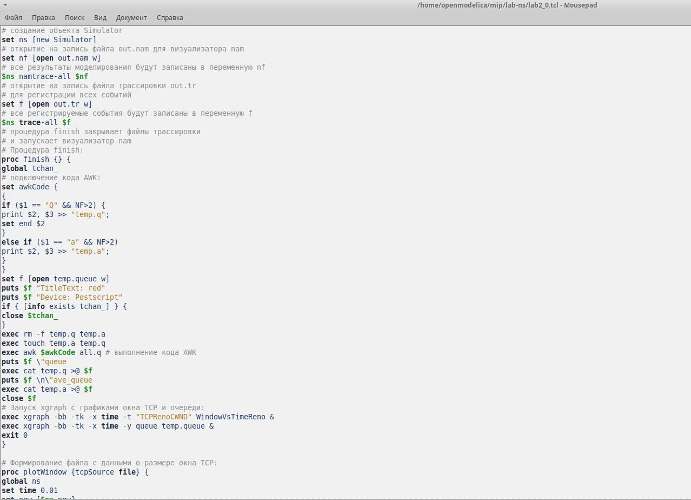
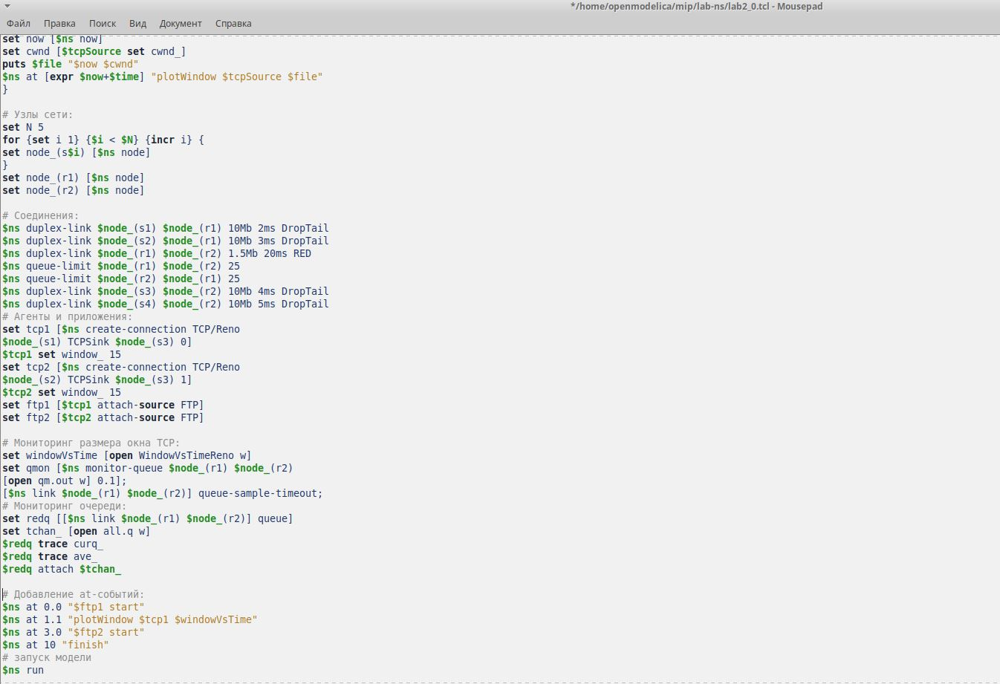
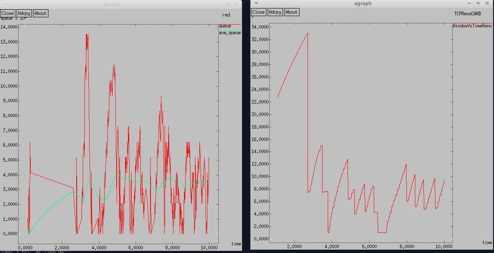
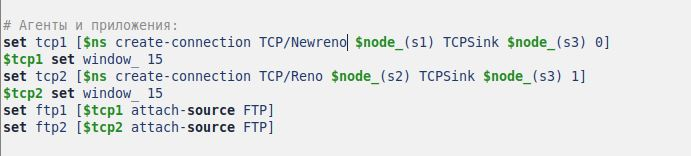
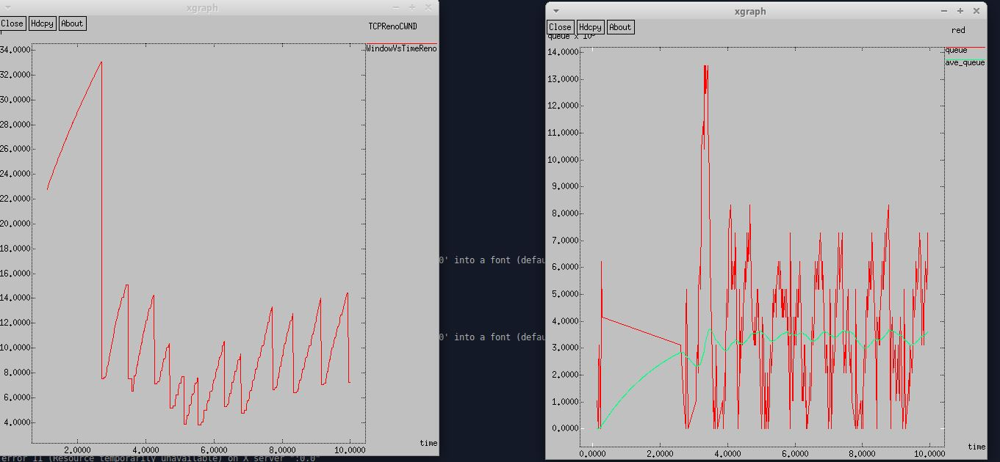
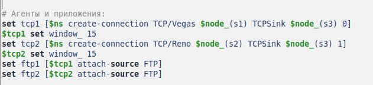
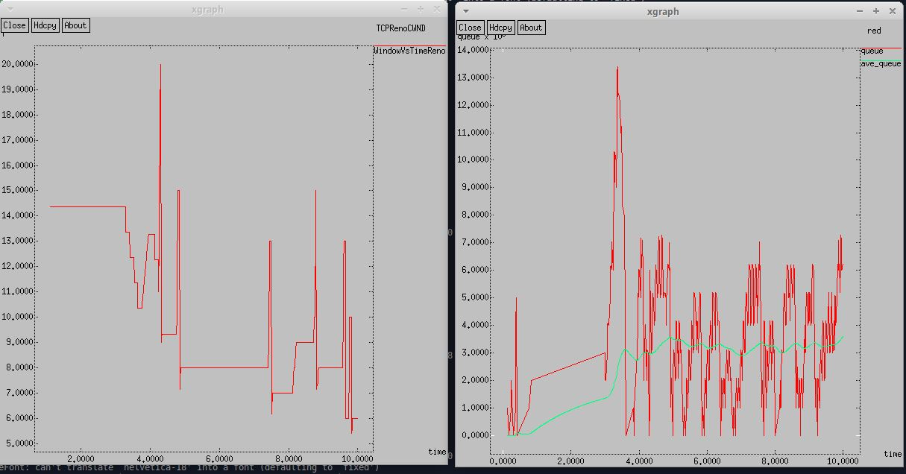
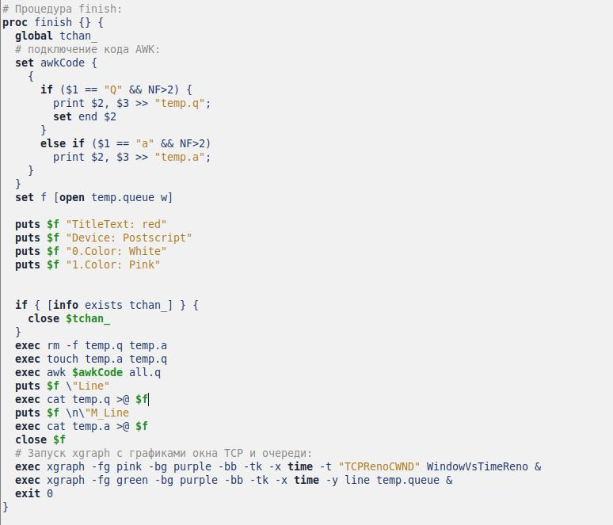
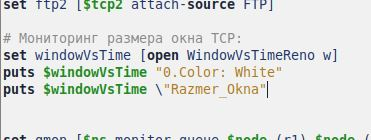
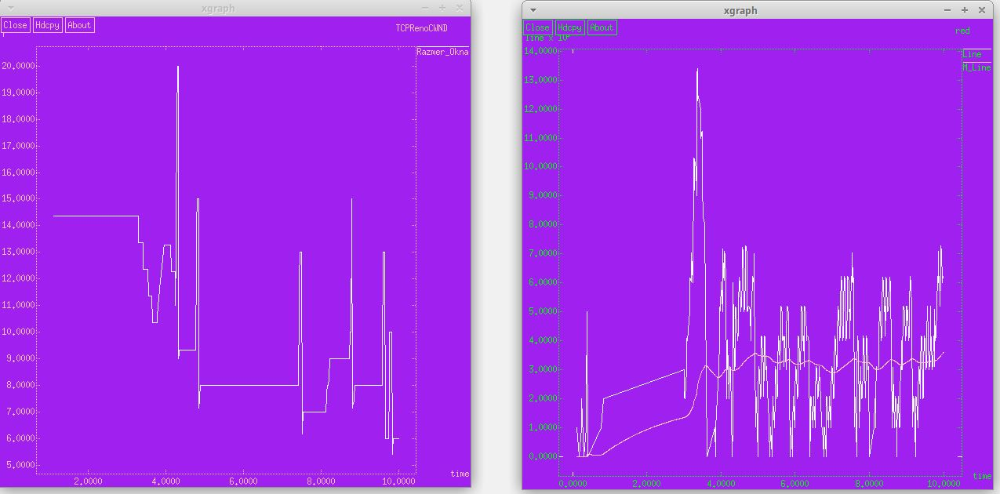

---
## Front matter
lang: ru-RU
title: Презентация к лабораторной работе 2
subtitle: Исследование протокола TCP и алгоритма управления очередью RED
author:
  - Сидорова Н.А.
institute:
  - Российский университет дружбы народов, Москва, Россия
  - Объединённый институт ядерных исследований, Дубна, Россия
date: 16 февраля 2025

## i18n babel
babel-lang: russian
babel-otherlangs: english

## Formatting pdf
toc: false
toc-title: Содержание
slide_level: 2
aspectratio: 169
section-titles: true
theme: metropolis
header-includes:
 - \metroset{progressbar=frametitle,sectionpage=progressbar,numbering=fraction}
---

## Пример с дисциплиной RED

{#fig:001 width=70%}

## Продолжение кода примера

{#fig:002 width=70%}

## Запустила Xgraph

{#fig:003 width=70%}

## NewReno

{#fig:004 width=70%}

## NewReno график

{#fig:005 width=70%}

## Vegas

{#fig:006 width=70%}

## Vegas график

{#fig:007 width=70%}

## Изменение оформления графика

{#fig:008 width=70%}

## Ещё изменения

{#fig:009 width=70%}

## Новый график

{#fig:010 width=70%}

:::

