---
## Front matter
title: "Отчёт по лабораторной работе 4"
subtitle: "Задания для самостоятельного выполнения"
author: "Сидорова Наталья Андреевна"

## Generic otions
lang: ru-RU
toc-title: "Содержание"

## Bibliography
bibliography: bib/cite.bib
csl: pandoc/csl/gost-r-7-0-5-2008-numeric.csl

## Pdf output format
toc: true # Table of contents
toc-depth: 2
lof: true # List of figures
lot: true # List of tables
fontsize: 12pt
linestretch: 1.5
papersize: a4
documentclass: scrreprt
## I18n polyglossia
polyglossia-lang:
  name: russian
  options:
	- spelling=modern
	- babelshorthands=true
polyglossia-otherlangs:
  name: english
## I18n babel
babel-lang: russian
babel-otherlangs: english
## Fonts
mainfont: IBM Plex Serif
romanfont: IBM Plex Serif
sansfont: IBM Plex Sans
monofont: IBM Plex Mono
mathfont: STIX Two Math
mainfontoptions: Ligatures=Common,Ligatures=TeX,Scale=0.94
romanfontoptions: Ligatures=Common,Ligatures=TeX,Scale=0.94
sansfontoptions: Ligatures=Common,Ligatures=TeX,Scale=MatchLowercase,Scale=0.94
monofontoptions: Scale=MatchLowercase,Scale=0.94,FakeStretch=0.9
mathfontoptions:
## Biblatex
biblatex: true
biblio-style: "gost-numeric"
biblatexoptions:
  - parentracker=true
  - backend=biber
  - hyperref=auto
  - language=auto
  - autolang=other*
  - citestyle=gost-numeric
## Pandoc-crossref LaTeX customization
figureTitle: "Рис."
tableTitle: "Таблица"
listingTitle: "Листинг"
lofTitle: "Список иллюстраций"
lotTitle: "Список таблиц"
lolTitle: "Листинги"
## Misc options
indent: true
header-includes:
  - \usepackage{indentfirst}
  - \usepackage{float} # keep figures where there are in the text
  - \floatplacement{figure}{H} # keep figures where there are in the text
---

# Выполнение лабораторной работы

По заданию создала модель сети, состоящей из 20 TCP источников и 20 TCP приемников, двух маршрутизаторов между приемниками и источниками. Между TCP источниками и первым маршрутизатором установлены дуплексные соединения с пропускной способностью 100 Мбит/с, задержкой 20мс и очередью DropTail. Между TCP приемниками и вторым маршрутизатором установлены дуплексные соединения с пропускной способностью 100 Мбит/с, задержкой 20мс и очередью DropTail. Между маршрутизаторами установлено симплексное соединение с пропускной способностью 20 Мбит/с, задержкой 15 мс и очередью типа RED, размер буфера 300 пакетов. В обратную сторону установлено симплексное соединение с пропускной способностью 15 Мбит/с, задержкой 20 мс и очередью типа DropTail (рис. [-@fig:001]).

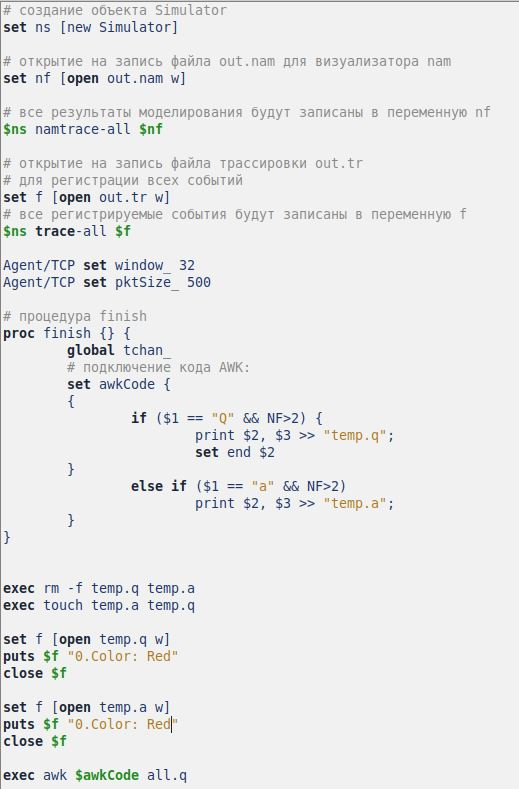{#fig:001 width=70%}

(рис. [-@fig:002]).

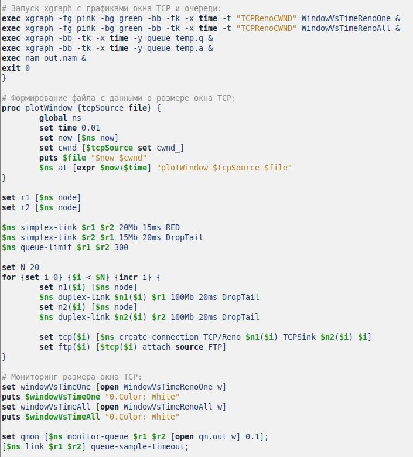{#fig:002 width=70%}

(рис. [-@fig:003]).

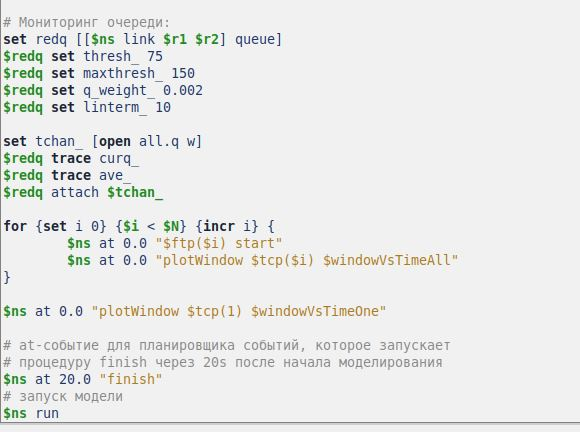{#fig:003 width=70%}

Получилась модель, подходящая требованиям (рис. [-@fig:004]).

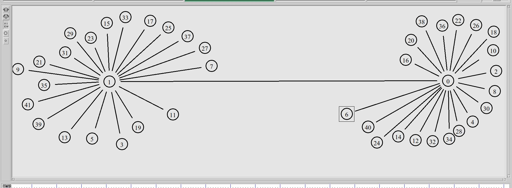{#fig:004 width=70%}

График Xgraph изменения размера TCP окна на линке одного источника (рис. [-@fig:005]).

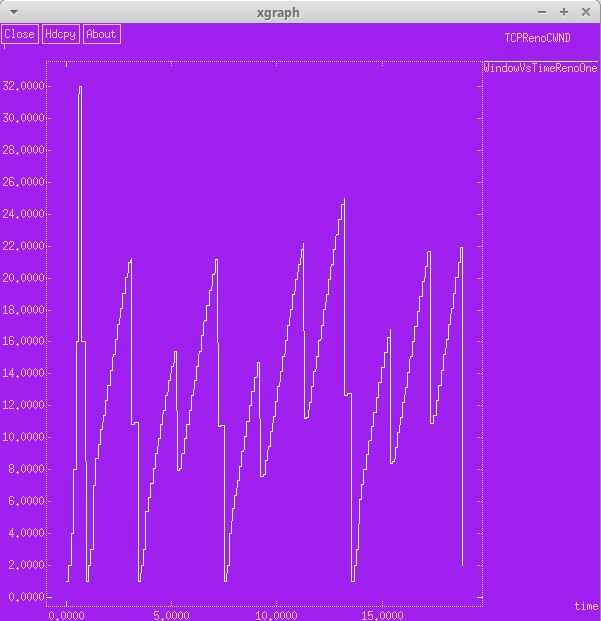{#fig:005 width=70%}

График Xgraph изменения размера TCP окна на всех источниках (рис. [-@fig:006]).

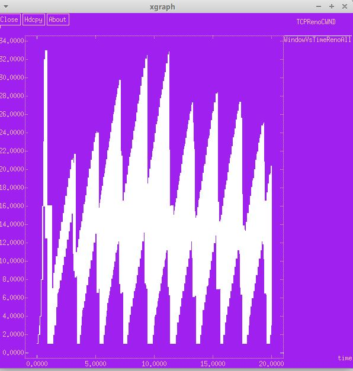{#fig:006 width=70%}

График Xgraph изменения размера очереди (рис. [-@fig:007]).

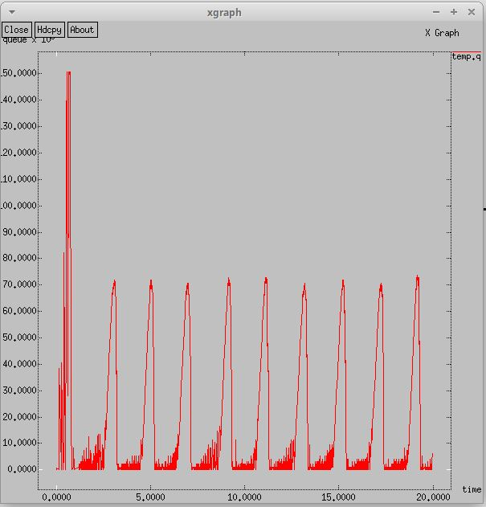{#fig:007 width=70%}

График Xgraph изменения размера средней очереди (рис. [-@fig:008]).

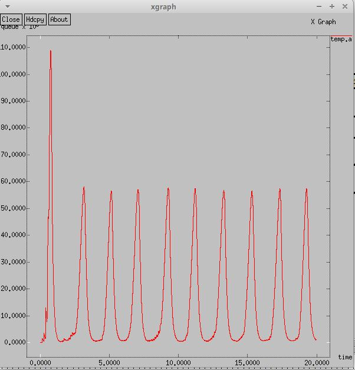{#fig:008 width=70%}

Создала те же графики, но в GNUPlot (рис. [-@fig:009]).

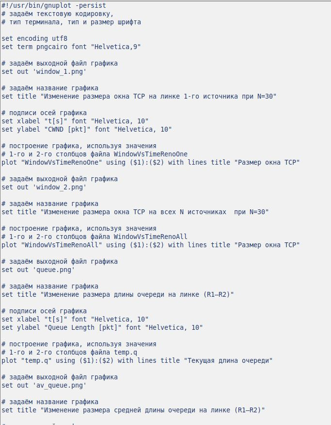{#fig:009 width=70%}

(рис. [-@fig:010]).

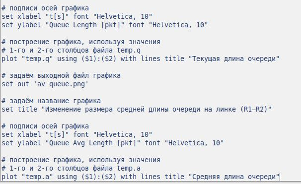{#fig:010 width=70%}

График GNUPlot изменения размера средней очереди (рис. [-@fig:011]).

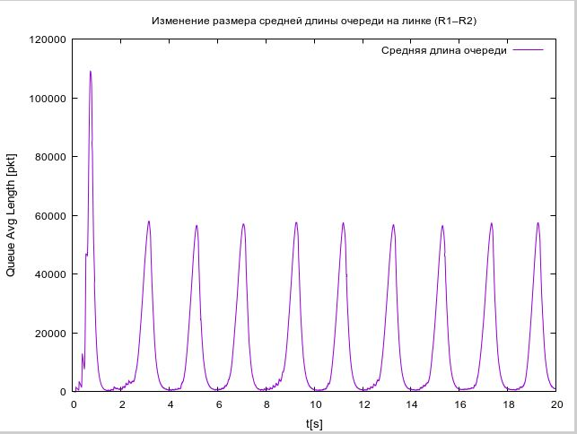{#fig:011 width=70%}

График GNUPlot изменения размера очереди (рис. [-@fig:012]).

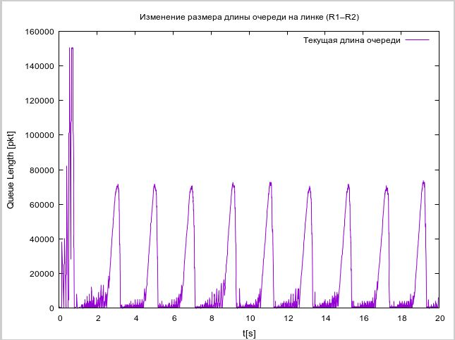{#fig:012 width=70%}

График GNUPlot изменения размера TCP окна на линке одного источника (рис. [-@fig:013]).

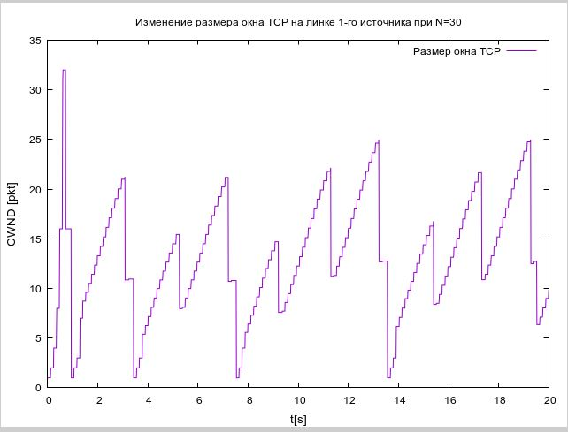{#fig:013 width=70%}

График GNUPlot изменения размера TCP окна на всех источниках (рис. [-@fig:014]).

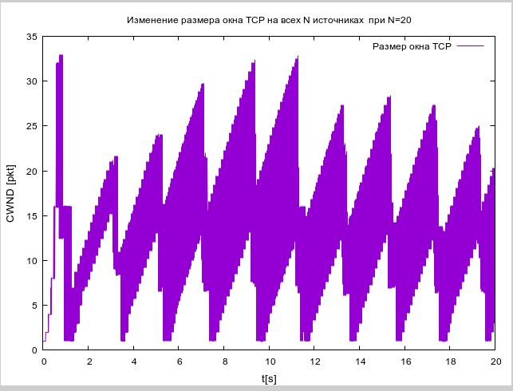{#fig:014 width=70%}

# Выводы

Создала свою сеть в NS-2, смоделировала передачу данных по моей сети, создала графики изменения длины очереди, средней длины очереди, изменения размера TCP окна на линке одного источника, изменения размера TCP окна на всех источниках в GNUPlot и Xgraph

# Список литературы{.unnumbered}

::: {#refs}
:::
