---
## Front matter
lang: ru-RU
title: Лабораторная работа 5
subtitle: Модель эпидемии SIR
author:
  - Сидорова Н.А.
institute:
  - Российский университет дружбы народов, Москва, Россия
  - Объединённый институт ядерных исследований, Дубна, Россия
date: 2 марта 2025

## i18n babel
babel-lang: russian
babel-otherlangs: english

## Formatting pdf
toc: false
toc-title: Содержание
slide_level: 2
aspectratio: 169
section-titles: true
theme: metropolis
header-includes:
 - \metroset{progressbar=frametitle,sectionpage=progressbar,numbering=fraction}
---

## Установила скорости

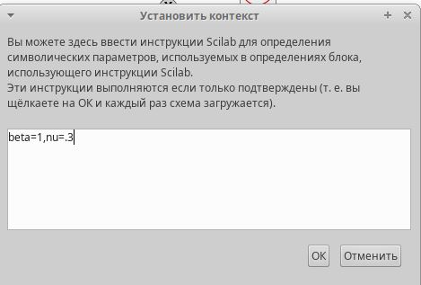{#fig:001 width=70%}

## Графическая модель

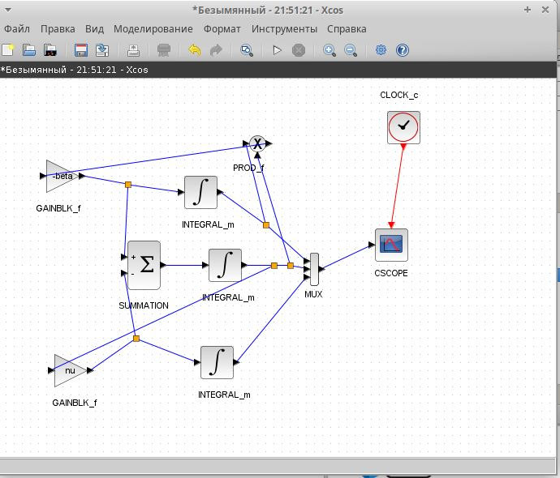{#fig:002 width=70%}

## Установка доли

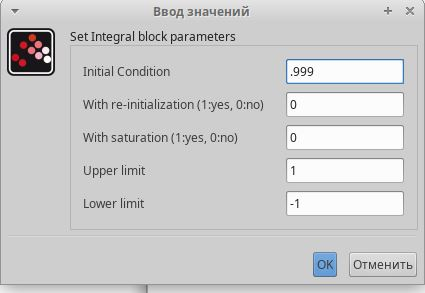{#fig:003 width=70%}

## Время интегрирования

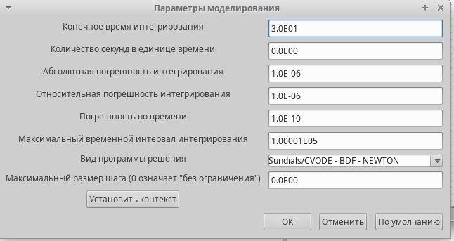{#fig:004 width=70%}

## График эпидемии

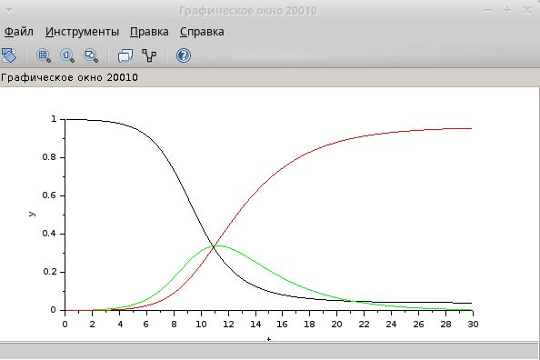{#fig:005 width=70%}

## Установила переменные

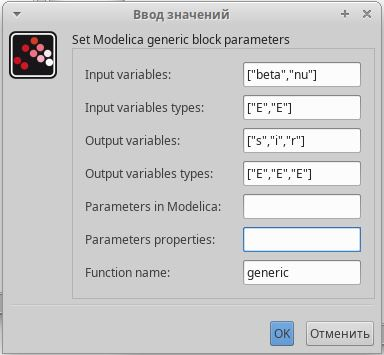{#fig:006 width=70%}

## Код

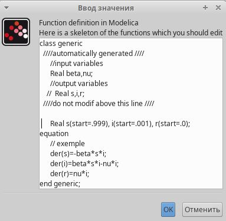{#fig:007 width=70%}

## Графическая модель

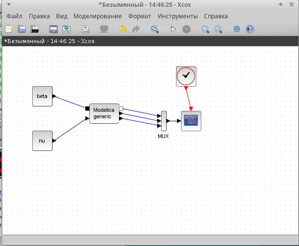{#fig:008 width=70%}

## График эпидемии

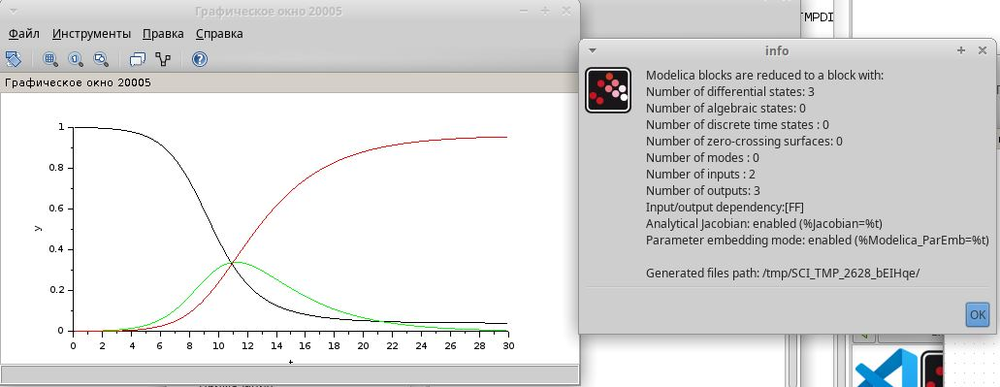{#fig:009 width=70%}

## OpenModelica

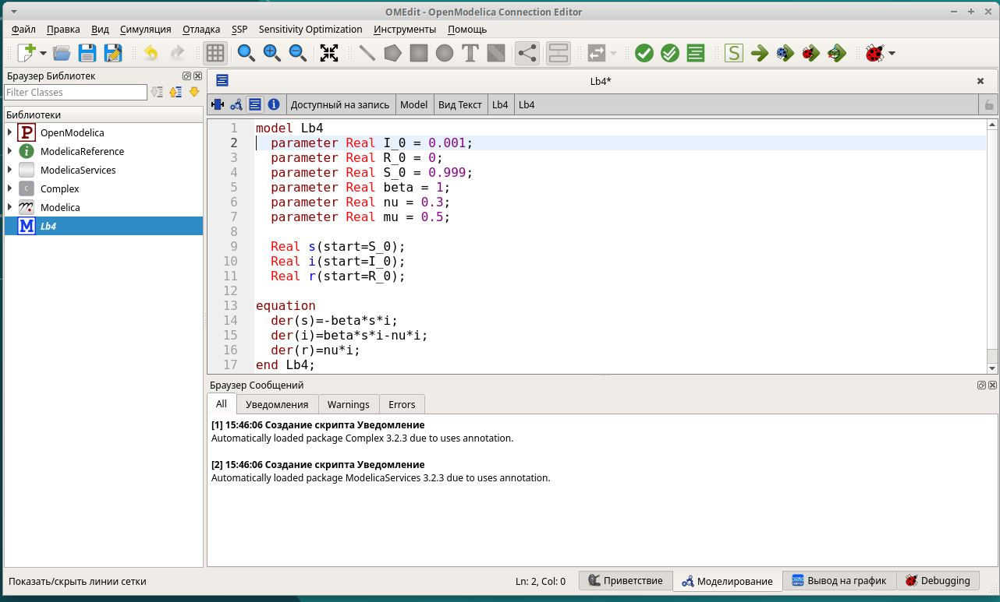{#fig:010 width=70%}

## Настройка времени

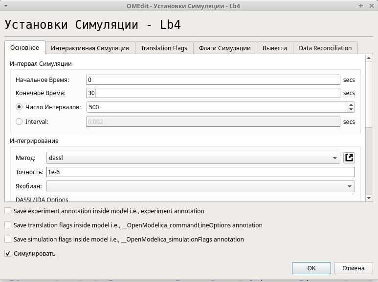{#fig:011 width=70%}

## График

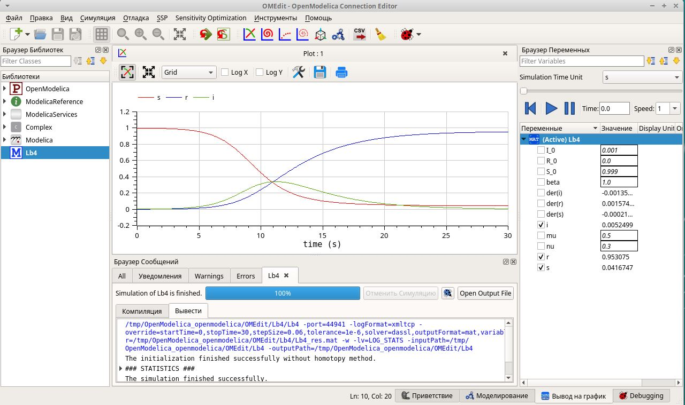{#fig:012 width=70%}

## Изменения уравнений

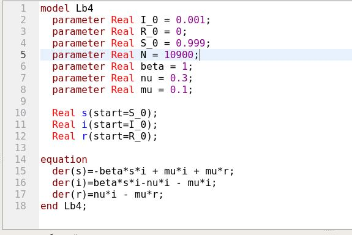{#fig:013 width=70%}

## Эпидемия изменилась

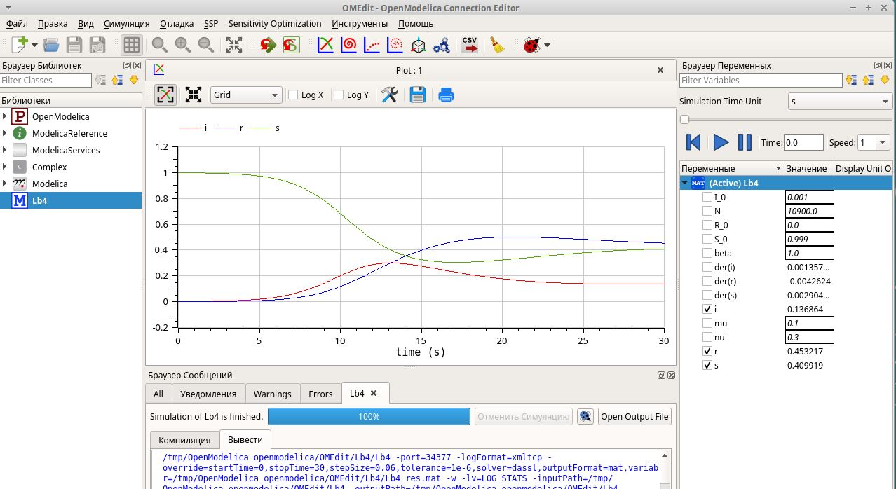{#fig:014 width=70%}

## Новая модель

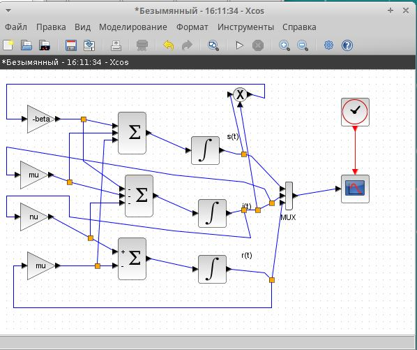{#fig:015 width=70%}

## Переменные

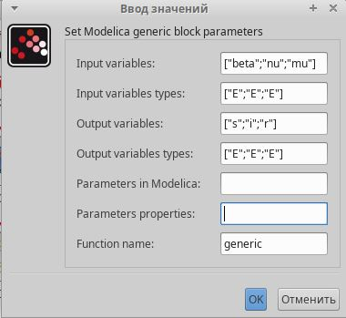{#fig:016 width=70%}

## Код

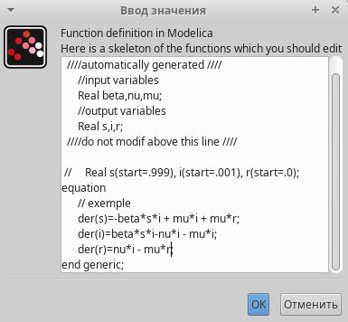{#fig:017 width=70%}

## Новая модель в Modelica

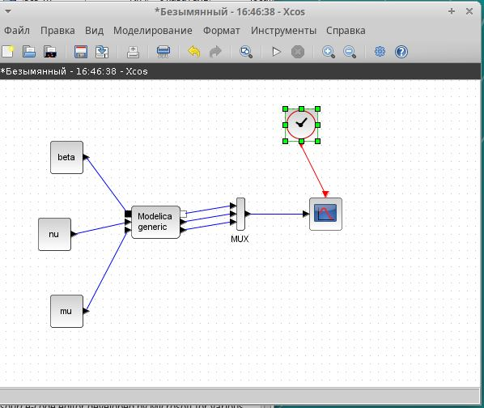{#fig:018 width=70%}

## Разные графики

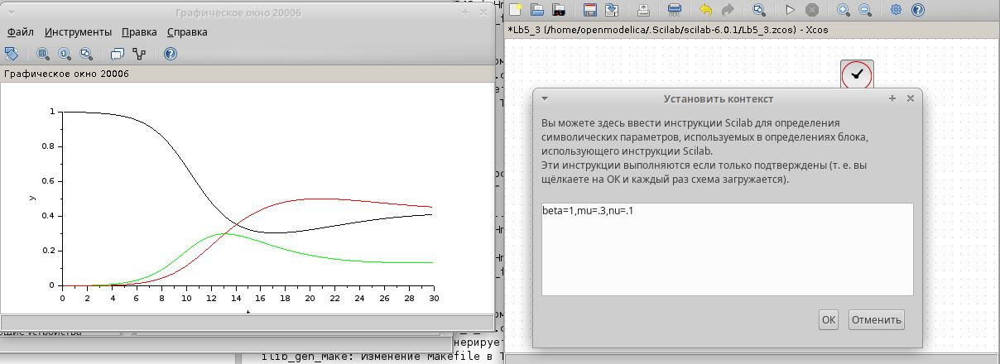{#fig:019 width=70%}

## Разные графики

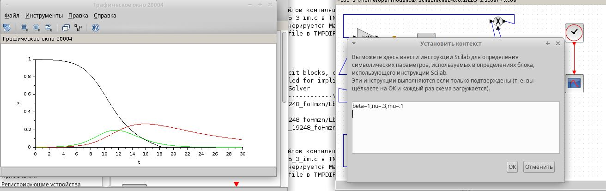{#fig:020 width=70%}

## Разные графики

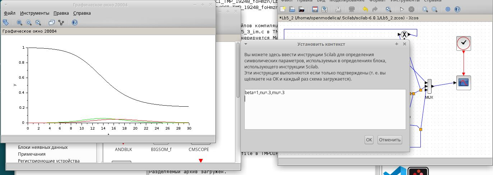{#fig:021 width=70%}

## Разные графики

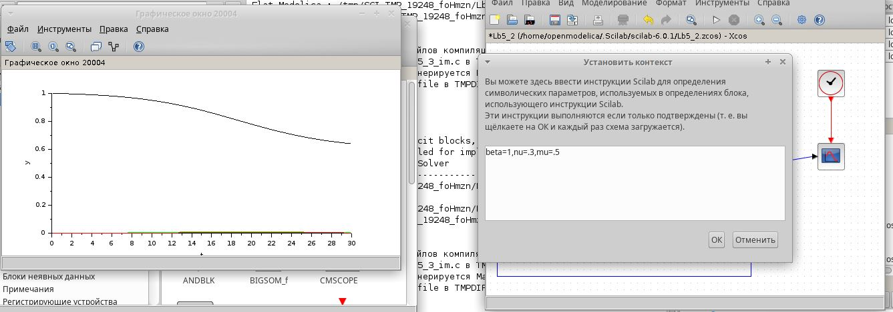{#fig:022 width=70%}

## Разные графики

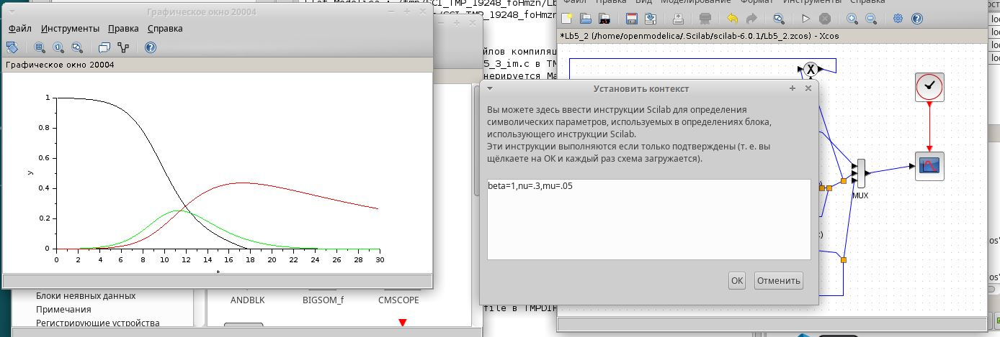{#fig:023 width=70%}

## Разные графики

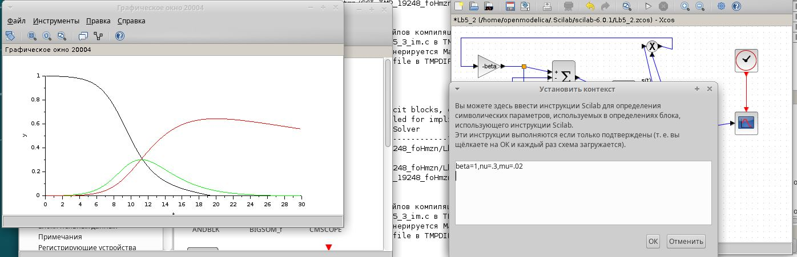{#fig:024 width=70%}

:::

