---
## Front matter
title: "Отчёт по лабораторной работе 5"
subtitle: "Модель эпидемии SIR"
author: "Наталья Андреевна Сидорова"

## Generic otions
lang: ru-RU
toc-title: "Содержание"

## Bibliography
bibliography: bib/cite.bib
csl: pandoc/csl/gost-r-7-0-5-2008-numeric.csl

## Pdf output format
toc: true # Table of contents
toc-depth: 2
lof: true # List of figures
lot: true # List of tables
fontsize: 12pt
linestretch: 1.5
papersize: a4
documentclass: scrreprt
## I18n polyglossia
polyglossia-lang:
  name: russian
  options:
	- spelling=modern
	- babelshorthands=true
polyglossia-otherlangs:
  name: english
## I18n babel
babel-lang: russian
babel-otherlangs: english
## Fonts
mainfont: IBM Plex Serif
romanfont: IBM Plex Serif
sansfont: IBM Plex Sans
monofont: IBM Plex Mono
mathfont: STIX Two Math
mainfontoptions: Ligatures=Common,Ligatures=TeX,Scale=0.94
romanfontoptions: Ligatures=Common,Ligatures=TeX,Scale=0.94
sansfontoptions: Ligatures=Common,Ligatures=TeX,Scale=MatchLowercase,Scale=0.94
monofontoptions: Scale=MatchLowercase,Scale=0.94,FakeStretch=0.9
mathfontoptions:
## Biblatex
biblatex: true
biblio-style: "gost-numeric"
biblatexoptions:
  - parentracker=true
  - backend=biber
  - hyperref=auto
  - language=auto
  - autolang=other*
  - citestyle=gost-numeric
## Pandoc-crossref LaTeX customization
figureTitle: "Рис."
tableTitle: "Таблица"
listingTitle: "Листинг"
lofTitle: "Список иллюстраций"
lotTitle: "Список таблиц"
lolTitle: "Листинги"
## Misc options
indent: true
header-includes:
  - \usepackage{indentfirst}
  - \usepackage{float} # keep figures where there are in the text
  - \floatplacement{figure}{H} # keep figures where there are in the text
---

# Цель работы

Изучить модель эпидемии.

# Задание

Разработать модель эпидемии в xcos, Modelica, OpenModelica.

# Выполнение лабораторной работы

Я открыла xcos и в модели установила переменные - скорость заражения и скорость выздоровления (рис. [-@fig:001]).

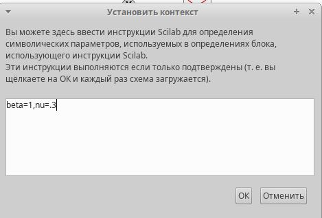{#fig:001 width=70%}

Создала графическую модель эпидемии, описанной дифференциальными уравнениями (рис. [-@fig:002]).

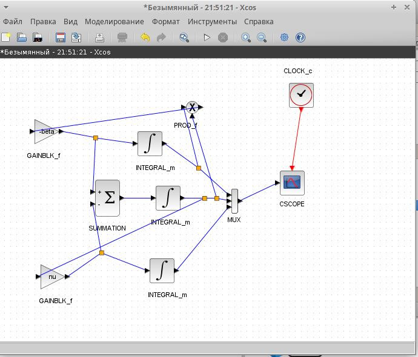{#fig:002 width=70%}

Установила в интегралах изначальную долю здоровых и заболевших (рис. [-@fig:003]).

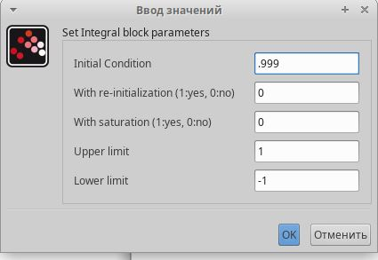{#fig:003 width=70%}

Время интегрирования - 30 секунд (рис. [-@fig:004]).

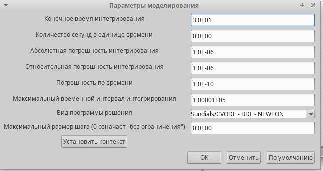{#fig:004 width=70%}

Получившийся график распространения эпидемии (рис. [-@fig:005]).

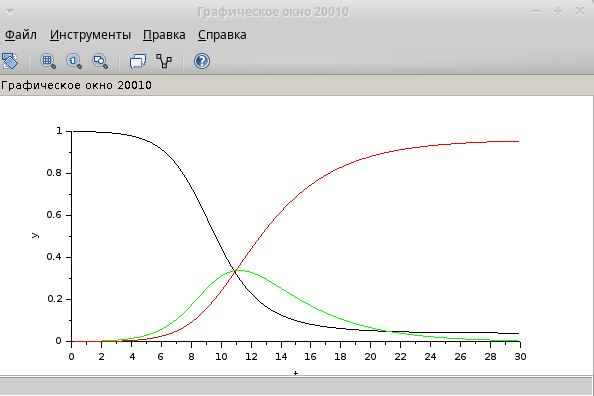{#fig:005 width=70%}

Установила переменные в блоке Modelica (рис. [-@fig:006]).

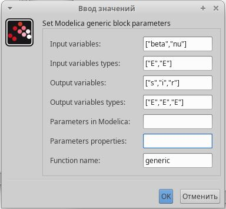{#fig:006 width=70%}

Написала код, который описывает дифференциальные уравнения и начальные параметры (рис. [-@fig:007]).

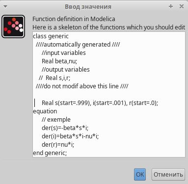{#fig:007 width=70%}

Графическая модель Modelica (рис. [-@fig:008]).

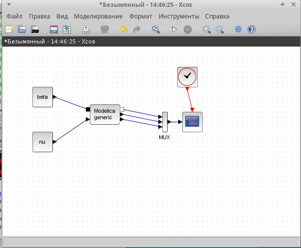{#fig:008 width=70%}

В Modelica график получился аналогичный (рис. [-@fig:009]).

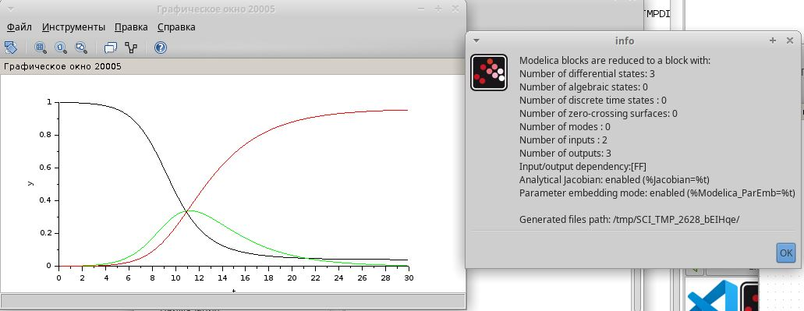{#fig:009 width=70%}

В OpenModelica не нужно строить графическую модель, все описывается кодом (рис. [-@fig:010]).

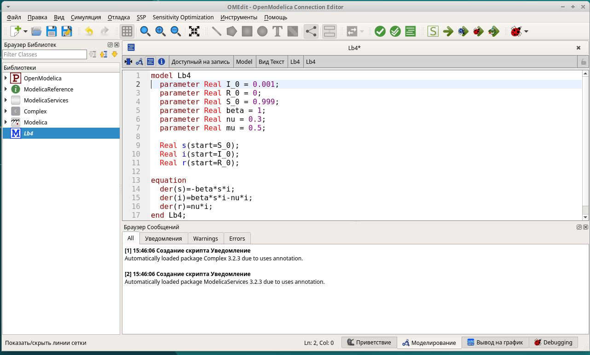{#fig:010 width=70%}

Настроила параметры (рис. [-@fig:011]).

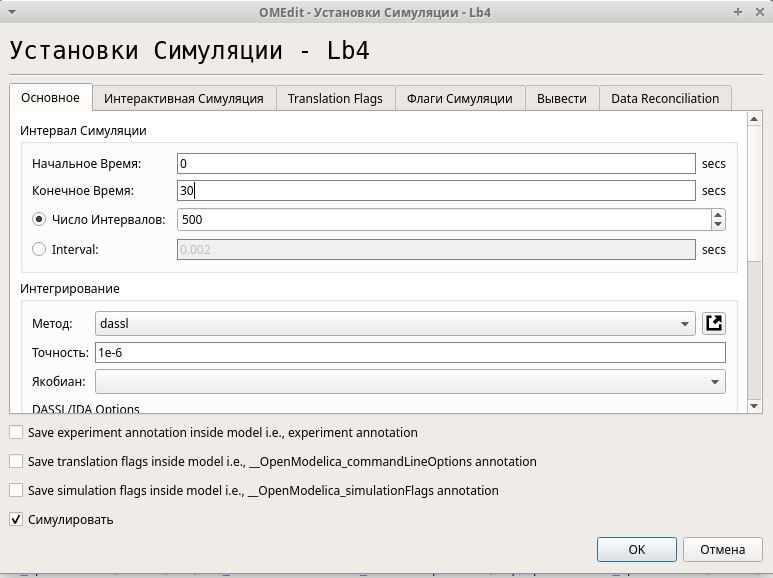{#fig:011 width=70%}

График получился идентичный с предыдущими (рис. [-@fig:012]).

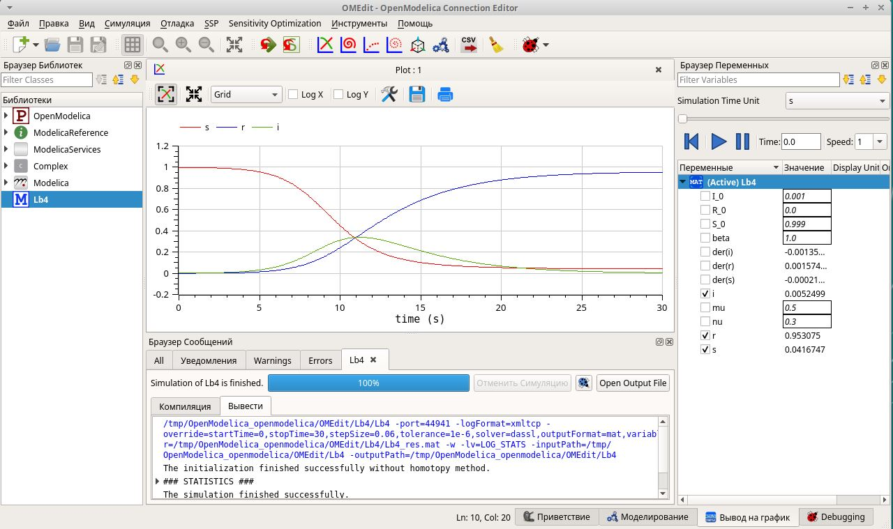{#fig:012 width=70%}

В задании для самостоятельного выполнения у нас добавились новые параметры - коэффициент рождаемости и смертности, соответственно изменились дифференциальные уравнения. Я изменила код в OpenModelica (рис. [-@fig:013]).

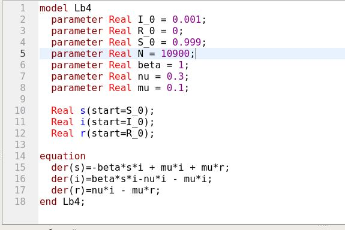{#fig:013 width=70%}

Теперь у эпидемии нет порога (рис. [-@fig:014]).

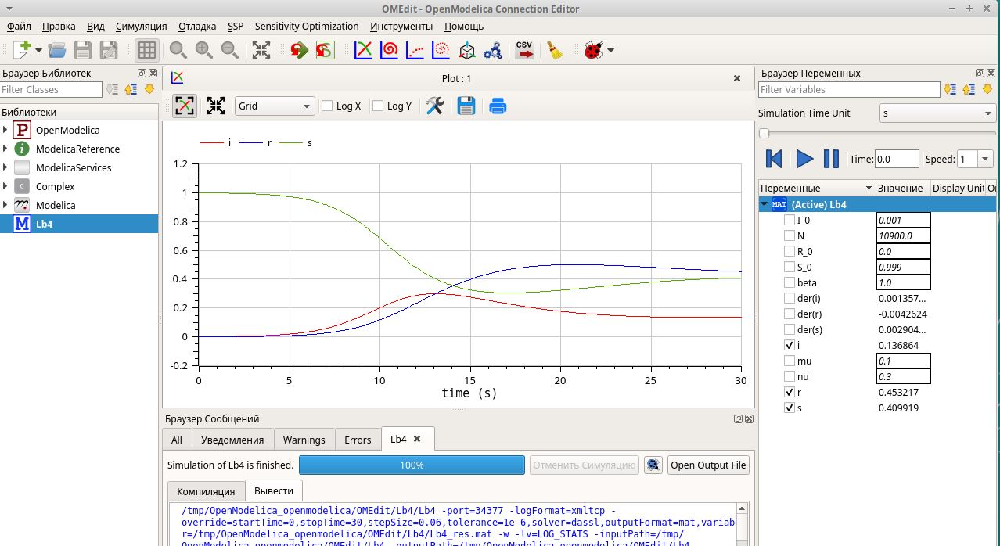{#fig:014 width=70%}

Новую модель графически представила в xcos (рис. [-@fig:015]).

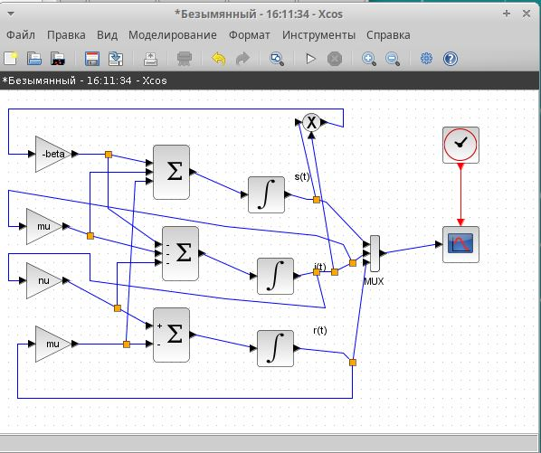{#fig:015 width=70%}

Задала переменные в Modelica (рис. [-@fig:016]).

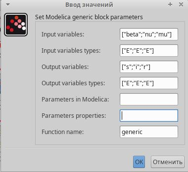{#fig:016 width=70%}

Модифицировала блок кода для новых условий (рис. [-@fig:017]).

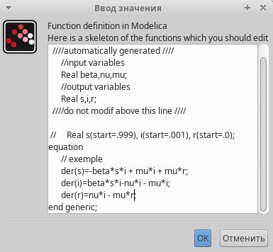{#fig:017 width=70%}

Новая модель в Modelica (рис. [-@fig:018]).

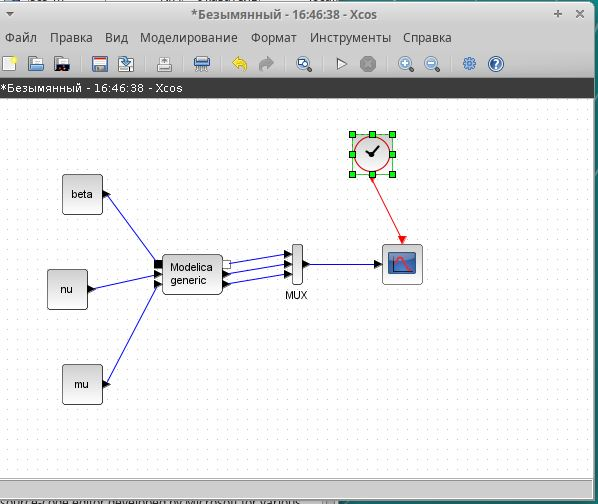{#fig:018 width=70%}

Получились разные графики при изменении кэ=оэффициента рождаемости и смертности (рис. [-@fig:019]).

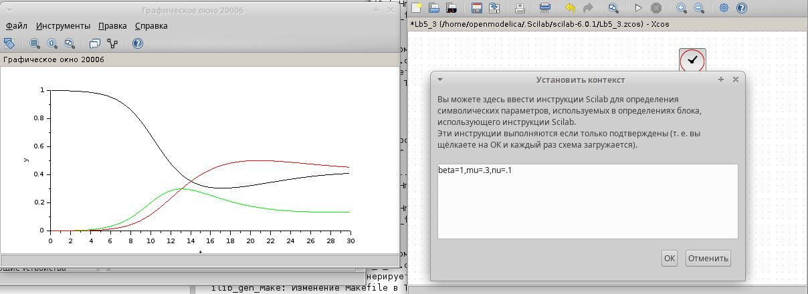{#fig:019 width=70%}

(рис. [-@fig:020]).

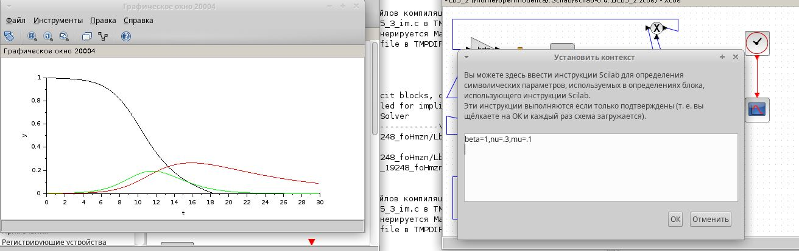{#fig:020 width=70%}

(рис. [-@fig:021]).

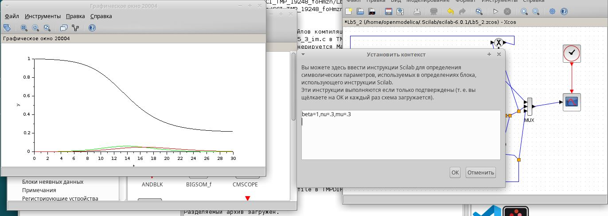{#fig:021 width=70%}

(рис. [-@fig:022]).

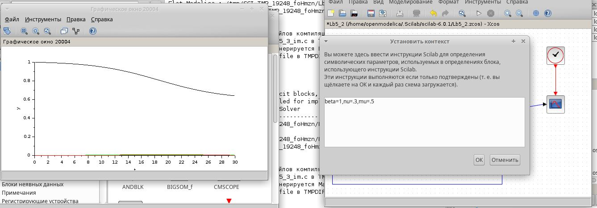{#fig:022 width=70%}

(рис. [-@fig:023]).

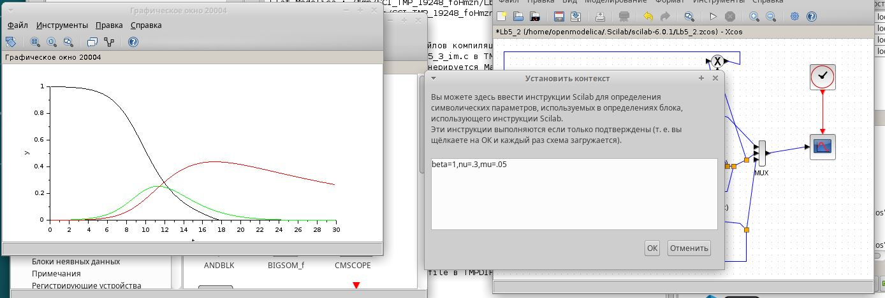{#fig:023 width=70%}

(рис. [-@fig:024]).

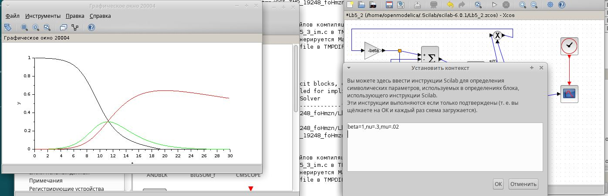{#fig:024 width=70%}

# Выводы

При увеличении коэффициента смертности и рождаемости люди гораздо меньше заболевают и большинство из них остаются здоровыми, эпидемия не преодолевает свой порог - состояние, после которого число здоровых стремится к 0, число заболевших стремится к 0, а число выздоровевших стремится к 100%.

# Список литературы{.unnumbered}

::: {#refs}
:::
