---
## Front matter
lang: ru-RU
title: Презентация по лабораторной работе 8
subtitle: Модель TCP/AQM
author:
  - Сидорова Н.А.
institute:
  - Российский университет дружбы народов, Москва, Россия
  - Объединённый институт ядерных исследований, Дубна, Россия
date: 24 марта 2025

## i18n babel
babel-lang: russian
babel-otherlangs: english

## Formatting pdf
toc: false
toc-title: Содержание
slide_level: 2
aspectratio: 169
section-titles: true
theme: metropolis
header-includes:
 - \metroset{progressbar=frametitle,sectionpage=progressbar,numbering=fraction}
---

## Математическая модель

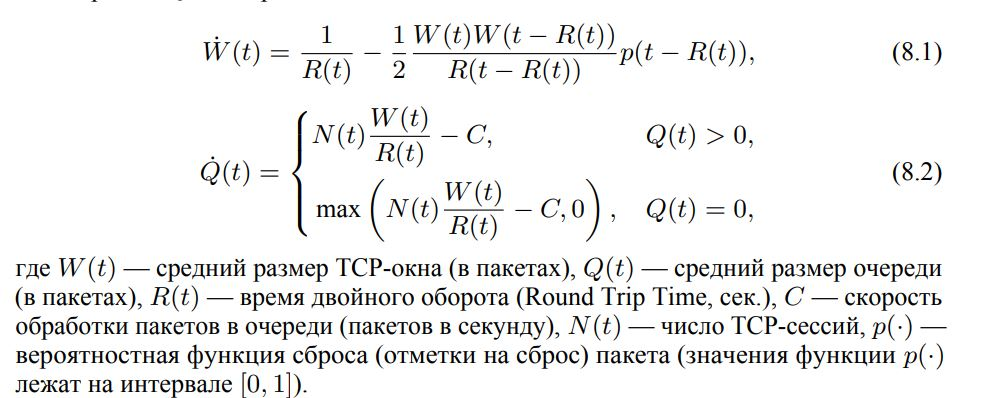{#fig:013 width=70%}

## Константы

Установила в контексте переменные, принимающие конкретные значения: N - число сессий, R - время двойного оборота, K - параметр задержки, C - скорость обработки пакетов, W0 - размер окна, Q0 - размер очереди 

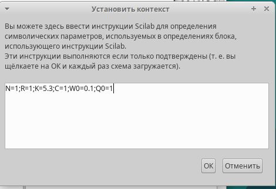{#fig:001 width=70%}

## Размер окна

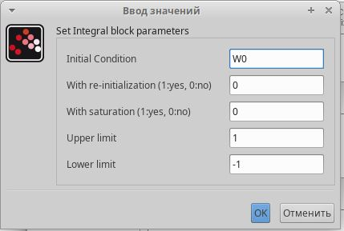{#fig:002 width=70%}

## Размер очереди

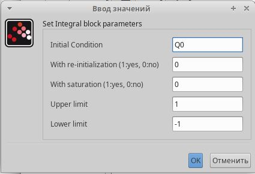{#fig:003 width=70%}

## Задержка

{#fig:004 width=70%}

## Модель

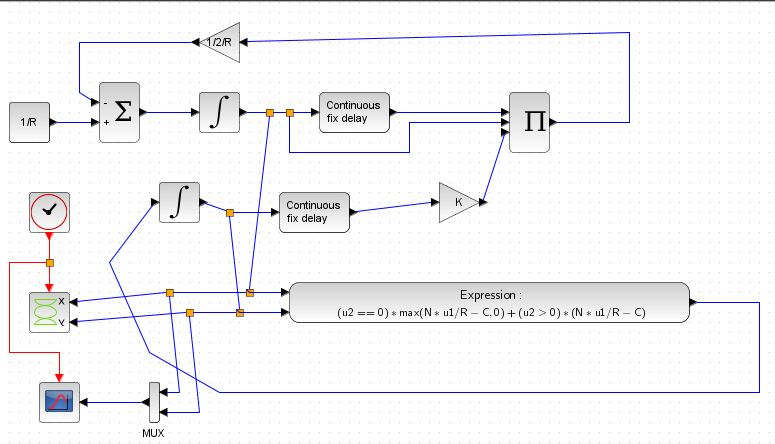{#fig:005 width=70%}

## Фазовый портрет

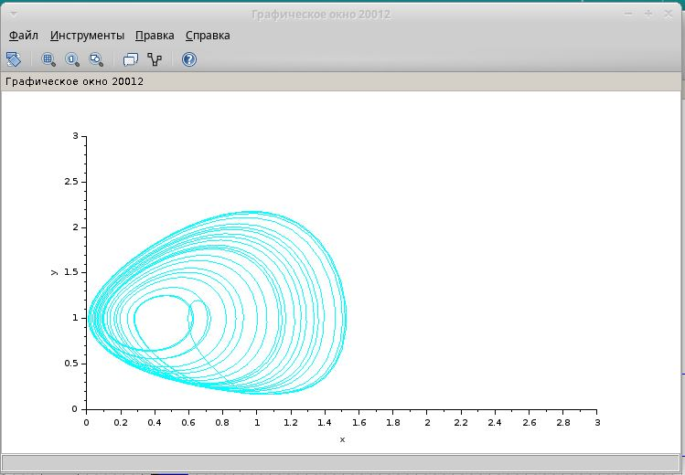{#fig:006 width=70%}

## Динамика изменений окна и очереди

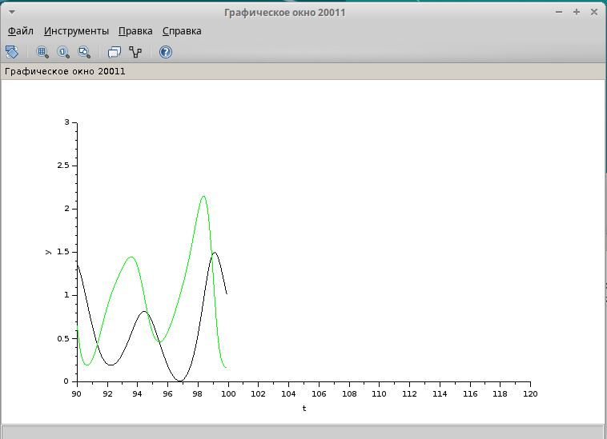{#fig:007 width=70%}

## Уменьшение скорости обработки пакетов

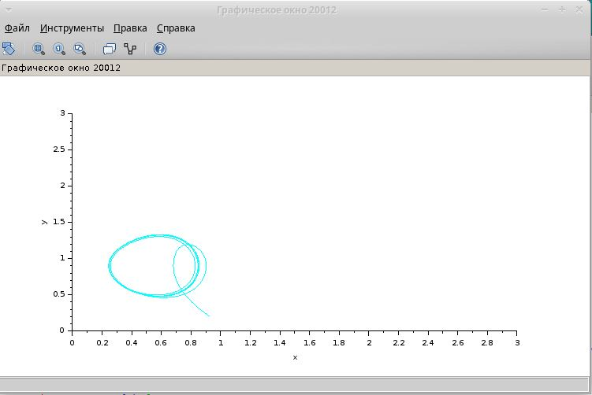{#fig:008 width=70%}

## Новый график

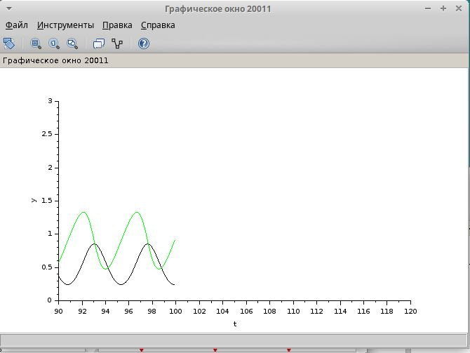{#fig:009 width=70%}

## Код

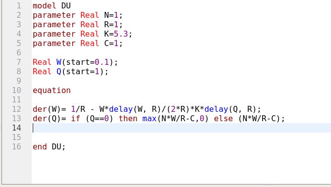{#fig:010 width=70%}

## График

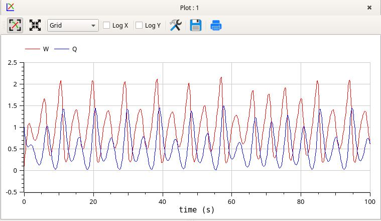{#fig:011 width=70%}

## Фазовый портрет

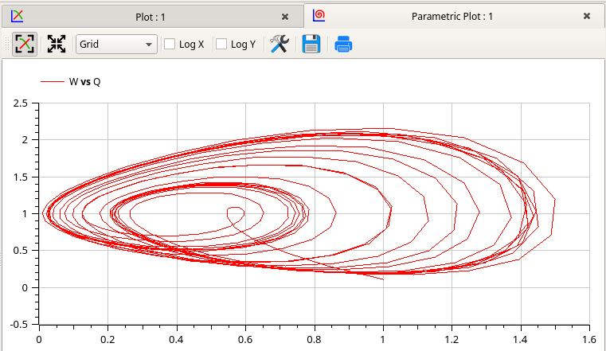{#fig:012 width=70%}

:::

