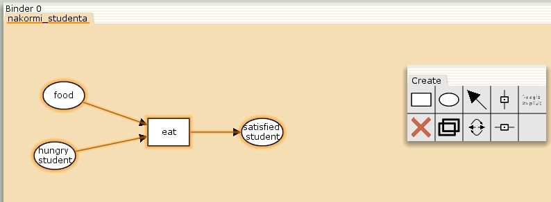
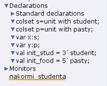
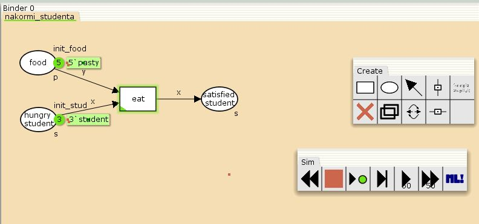
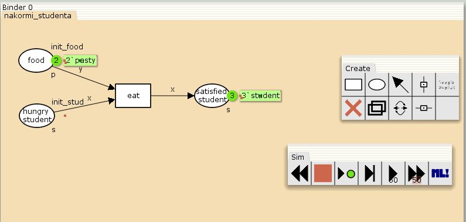
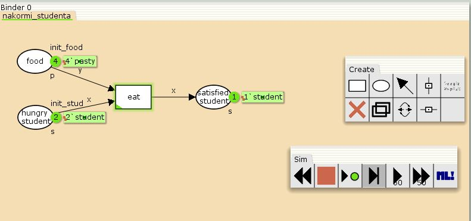
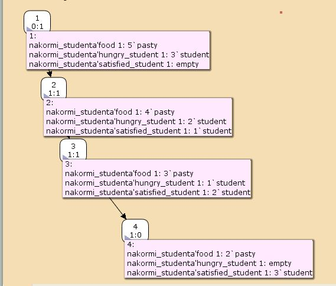
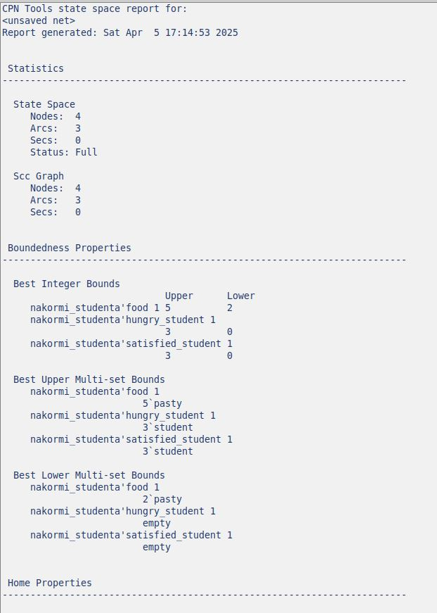
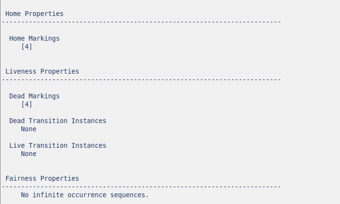

---
## Front matter
lang: ru-RU
title: Лабораторная работа 9
subtitle: Модель "Накорми студентов"
author:
  - Сидорова Н.А.
institute:
  - Российский университет дружбы народов, Москва, Россия
  - Объединённый институт ядерных исследований, Дубна, Россия
date: 05 апреля 2025

## i18n babel
babel-lang: russian
babel-otherlangs: english

## Formatting pdf
toc: false
toc-title: Содержание
slide_level: 2
aspectratio: 169
section-titles: true
theme: metropolis
header-includes:
 - \metroset{progressbar=frametitle,sectionpage=progressbar,numbering=fraction}
---

## Сеть Петри

{#fig:001 width=70%}

## Декларации

{#fig:002 width=70%}

## Готовая модель

{#fig:003 width=70%}

## Конец симуляции

{#fig:004 width=70%}

## Первый этап

{#fig:005 width=70%}

## State Space

{#fig:006 width=70%}

## Отчет

Статистика (число узлов, число дуг), ограниченность(верхние и нижние границы)
{#fig:007 width=70%}

## Отчет

Домашние маркировки, живые маркировки (тупики и переходы), справедливость(тип справедливости переходов).
{#fig:008 width=70%}

:::

