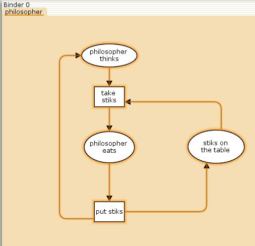
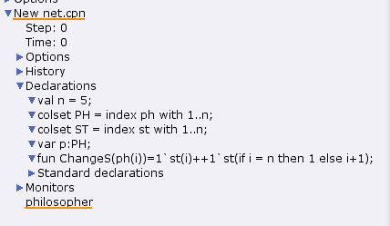
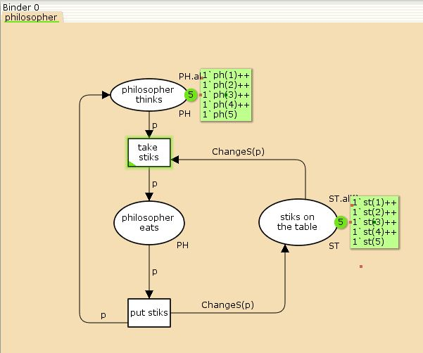
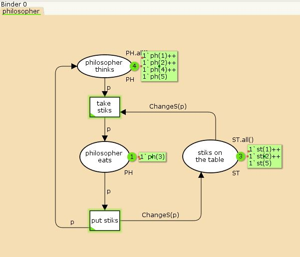
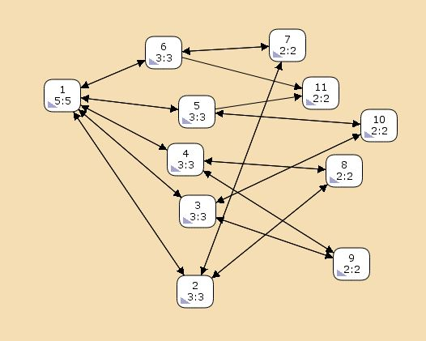
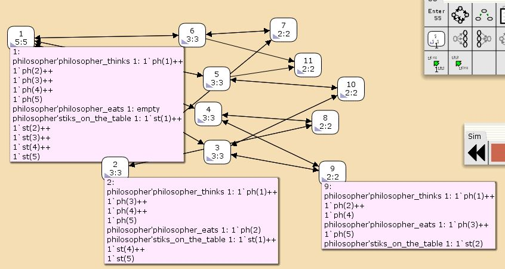
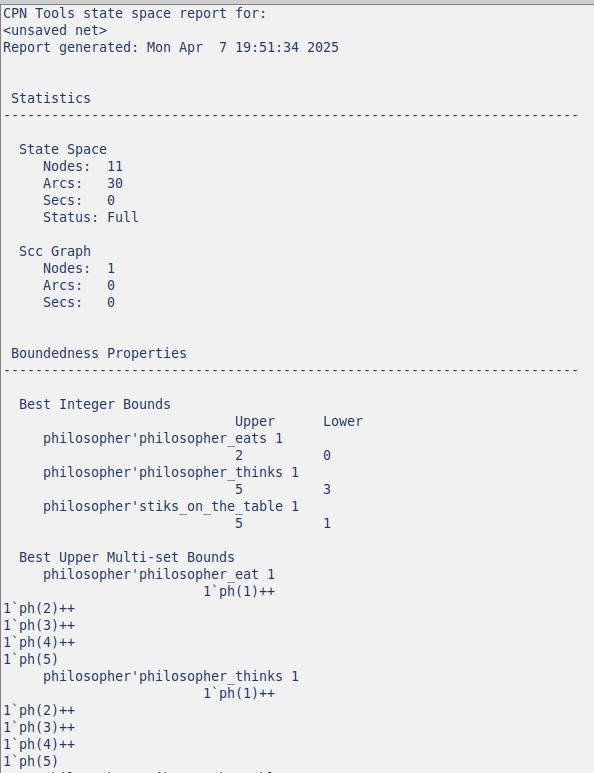

---
## Front matter
lang: ru-RU
title: Презентация по лабораторной работе 10 
subtitle: Задача об обедающих мудрецах
author:
  - Сидорова Н.А.
institute:
  - Российский университет дружбы народов, Москва, Россия
  - Объединённый институт ядерных исследований, Дубна, Россия
date: 07 апреля 2025

## i18n babel
babel-lang: russian
babel-otherlangs: english

## Formatting pdf
toc: false
toc-title: Содержание
slide_level: 2
aspectratio: 169
section-titles: true
theme: metropolis
header-includes:
 - \metroset{progressbar=frametitle,sectionpage=progressbar,numbering=fraction}
---

## Заготовка

Модель включает в себя три позиции и два перехода
{#fig:001 width=70%}

## Декларации

{#fig:002 width=70%}

## Готовая модель

{#fig:003 width=70%}

## Моделирование

{#fig:004 width=70%}

## Граф

{#fig:005 width=70%}

## Виды состояний

{#fig:006 width=70%}

## Статистика

{#fig:007 width=70%}

## Отчет

{#fig:008 width=70%}
 
:::

