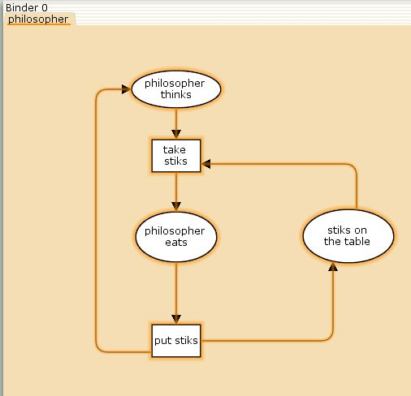
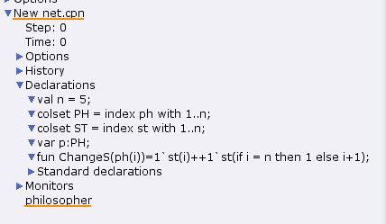
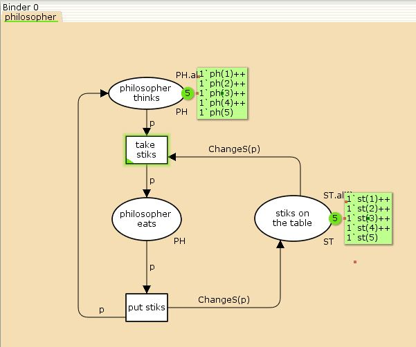
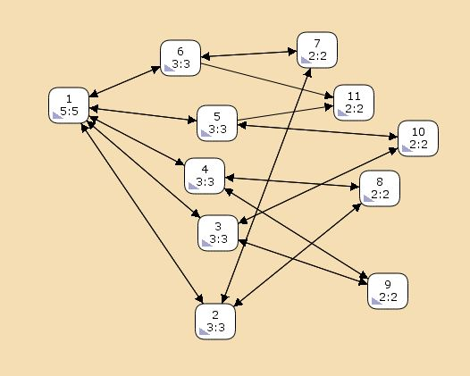
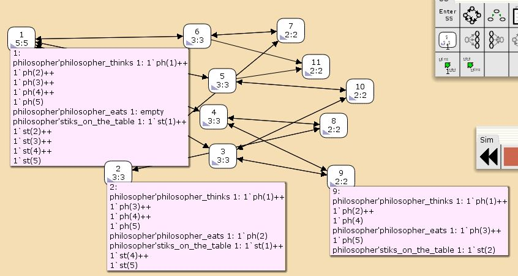
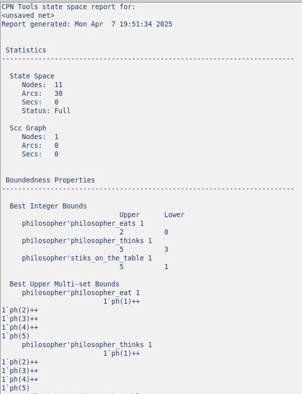
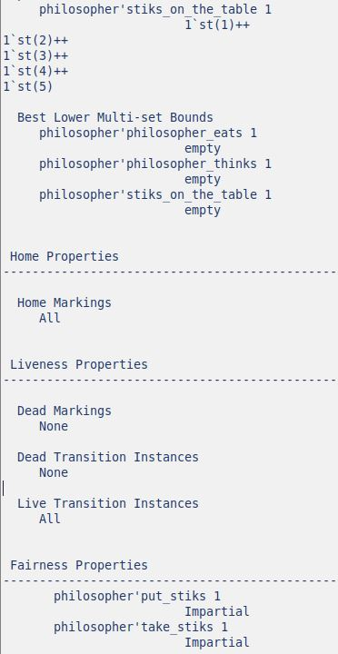

---
## Front matter
title: "Отчёт по лабораторной работе 10"
subtitle: "Задача об обедающих мудрецах"
author: "Наталья Андреевна Сидорова"

## Generic otions
lang: ru-RU
toc-title: "Содержание"

## Bibliography
bibliography: bib/cite.bib
csl: pandoc/csl/gost-r-7-0-5-2008-numeric.csl

## Pdf output format
toc: true # Table of contents
toc-depth: 2
lof: true # List of figures
lot: true # List of tables
fontsize: 12pt
linestretch: 1.5
papersize: a4
documentclass: scrreprt
## I18n polyglossia
polyglossia-lang:
  name: russian
  options:
	- spelling=modern
	- babelshorthands=true
polyglossia-otherlangs:
  name: english
## I18n babel
babel-lang: russian
babel-otherlangs: english
## Fonts
mainfont: IBM Plex Serif
romanfont: IBM Plex Serif
sansfont: IBM Plex Sans
monofont: IBM Plex Mono
mathfont: STIX Two Math
mainfontoptions: Ligatures=Common,Ligatures=TeX,Scale=0.94
romanfontoptions: Ligatures=Common,Ligatures=TeX,Scale=0.94
sansfontoptions: Ligatures=Common,Ligatures=TeX,Scale=MatchLowercase,Scale=0.94
monofontoptions: Scale=MatchLowercase,Scale=0.94,FakeStretch=0.9
mathfontoptions:
## Biblatex
biblatex: true
biblio-style: "gost-numeric"
biblatexoptions:
  - parentracker=true
  - backend=biber
  - hyperref=auto
  - language=auto
  - autolang=other*
  - citestyle=gost-numeric
## Pandoc-crossref LaTeX customization
figureTitle: "Рис."
tableTitle: "Таблица"
listingTitle: "Листинг"
lofTitle: "Список иллюстраций"
lotTitle: "Список таблиц"
lolTitle: "Листинги"
## Misc options
indent: true
header-includes:
  - \usepackage{indentfirst}
  - \usepackage{float} # keep figures where there are in the text
  - \floatplacement{figure}{H} # keep figures where there are in the text
---

# Цель работы

Создать модель задачи об обедающих мудрецах в CPN Tools.

# Задание

1. Смоделировать данную задачу
2. Создать отчет о пространстве состояний и построить граф.

# Теоретическое введение

5 мудрецов сидят за круглым столом и могут пребывать в одном из двух состояний - есть или думать. Между соседями лежит одна палочка для еды. Для приема пищи необходимо две палочки. Палочки - пересекающийся ресурс. Необходимо синхронизировать процесс еды так, чтобы мудрецы не умерли от голода.

# Выполнение лабораторной работы

Наша модель включает в себя три позииции: мудрец ест, мудрец думает, палочки лежат на столе. И два перехода: взять палочки, положить палочки (рис. [-@fig:001]).

{#fig:001 width=70%}

Декларации: объявляем переменную n - количество мудрецов и даем ей значение 5, объявляем два множества - мудрецов и палочек, в каждом из них значения от 1 до n, объявляем переменную p, пишем функцию для выбора палочек - мудрец выбирает палочку под своим номером и соседнюю, если это последний мудрец то он берет последнюю и первую палочки. (рис. [-@fig:002]).

{#fig:002 width=70%}

Добавляем фишки, подписываем все пути, позиции и переходы (рис. [-@fig:003]).

{#fig:003 width=70%}

Процесс моделирования (рис. [-@fig:004]).

{#fig:004 width=70%}

Построила граф пространства состояний (рис. [-@fig:005]).

{#fig:005 width=70%}

В графе есть 3 типа состояний: начальное - все мудрецы думают, один мудрец ест и задействует дву палочки, два мудреца едят и на столе остается одна палочка. (рис. [-@fig:006]).

{#fig:006 width=70%}

Отчет: статистика по графу, максимальные и минимальные значения каждого множества (рис. [-@fig:007]).

{#fig:007 width=70%}

Маркировки и тип графа (рис. [-@fig:008]).

{#fig:008 width=70%}

# Выводы

Я смоделировала задачу об обедающих мудрецах и создала отчет по пространству состояний данного графа.

# Список литературы{.unnumbered}

::: {#refs}
:::
