---
## Front matter
lang: ru-RU
title: Презентация по лабораторной работе 11
subtitle: Модель системы массового обслуживания M|M|1
author:
  - Сидорова Н.А.
institute:
  - Российский университет дружбы народов, Москва, Россия
  - Объединённый институт ядерных исследований, Дубна, Россия
date: 19 апреля 2025

## i18n babel
babel-lang: russian
babel-otherlangs: english

## Formatting pdf
toc: false
toc-title: Содержание
slide_level: 2
aspectratio: 169
section-titles: true
theme: metropolis
header-includes:
 - \metroset{progressbar=frametitle,sectionpage=progressbar,numbering=fraction}
---

## Общая система

Сеть Петри для самой системы, сервер и генератор заявок описываются отдельными сетями, также здесь есть позиции очередь и обслуженная заявка 

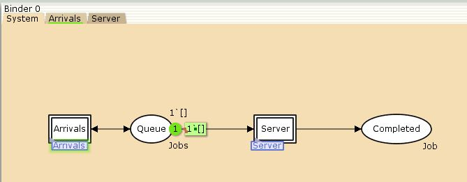{#fig:001 width=70%}

## Генератор заявок

Сеть Петри для генератора заявок. Имеет позиции текущая заявка, следующая заявка и очередь. Два перехода: распределение поступления заявок и определение поступления заявки в очередь 

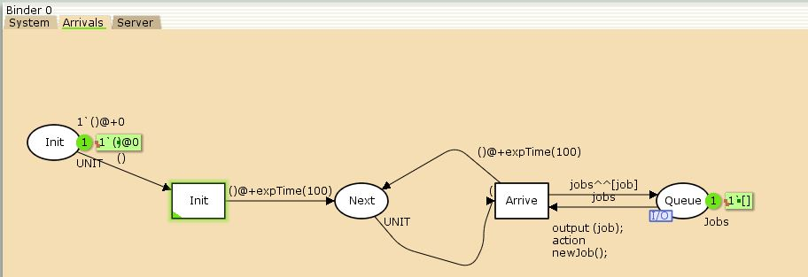{#fig:002 width=70%}

## Сервер

Сеть Петри для сервера. Имеет позиции: очередь, сервер занят, сервер простаивает и заявка выполнена. Переходы: старт и стоп работы сервера. 

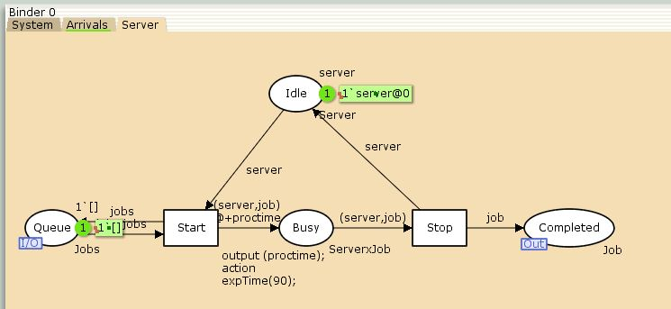{#fig:003 width=70%}

## Декларации

Декларации: определния множеств, инициализация переменных, объявление функций 

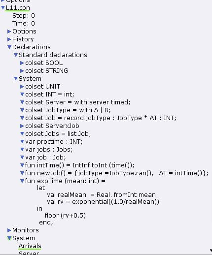{#fig:004 width=70%}

## Моделирование

Моделирование системы 

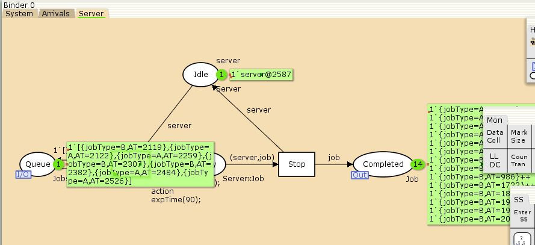{#fig:007 width=70%}

## Observer

Мониторинг параметров очереди. Изменение функции Observer чтобы получить значение задержки в очереди 

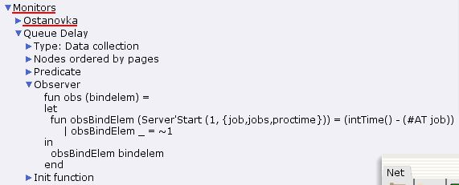{#fig:005 width=70%}

## Predicate

Изменение функции Predicate чтобы останавливать мониторинг 

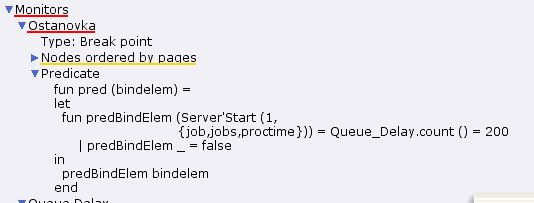{#fig:006 width=70%}

## Queue Delay.log

Значения файла Queue Delay.log, содержащие значение задержки очереди, счетчик, шаг, время 

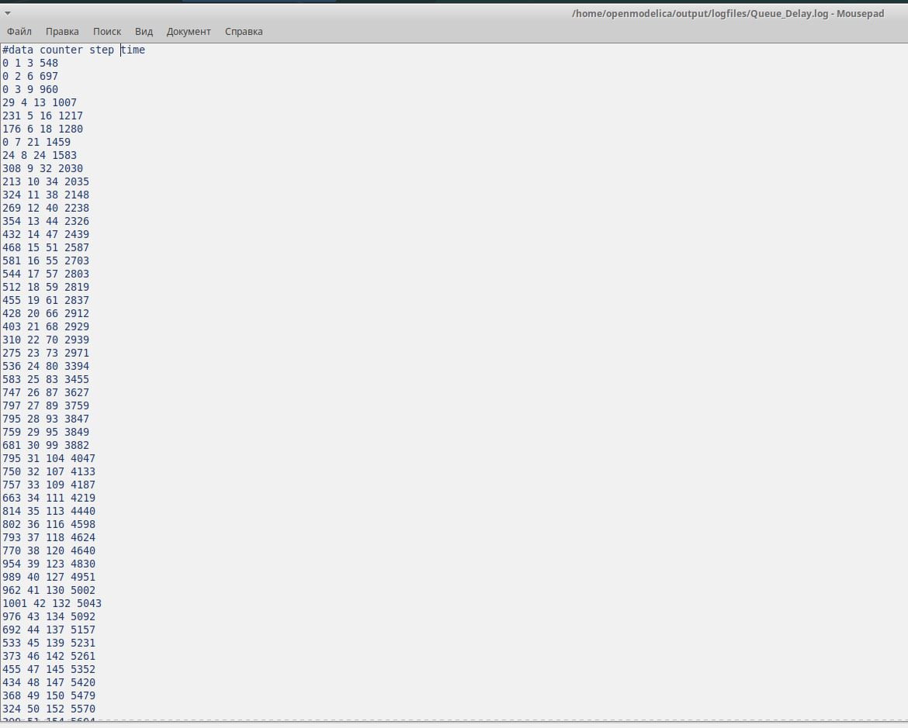{#fig:008 width=70%}

## Код графика

Код для создания графика задержки в очереди 

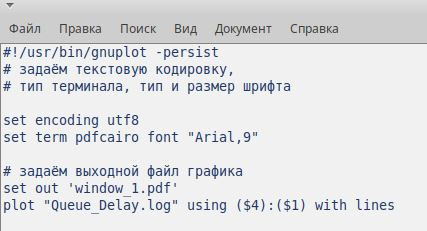{#fig:009 width=70%}

## График задержки

График задержки в очереди 

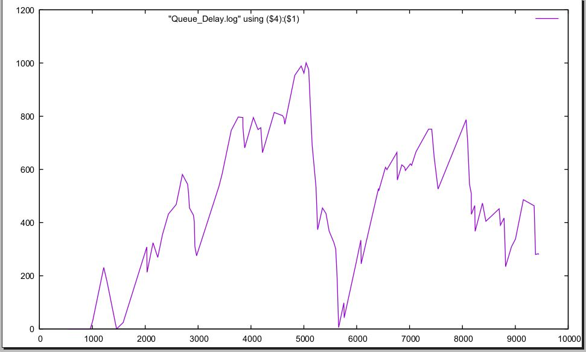{#fig:010 width=70%}

## Queue Delay Real

Добавляем монитор Queue Delay Real и изменяем функцию Observer для действительных значений 

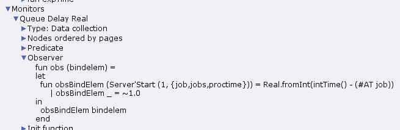{#fig:011 width=70%}

## Queue Delay Real.log

Значения Queue Delay Real.log 

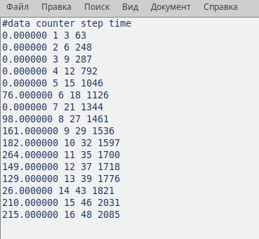{#fig:012 width=70%}

## Long Delay Time

Добавляем монитор Long Delay Time и изменяем функцию Observer чтобы посчитать сколько раз задержка превысила заданное значение 

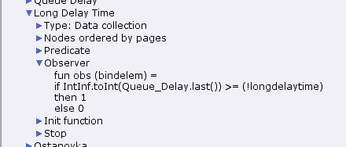{#fig:013 width=70%}

## Новая переменная

Добавляем новую переменную в декларации 

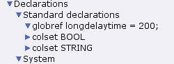{#fig:014 width=70%}

## Код для графика

Код для графика в какие периоды значения задержки в очереди превышали заданное 

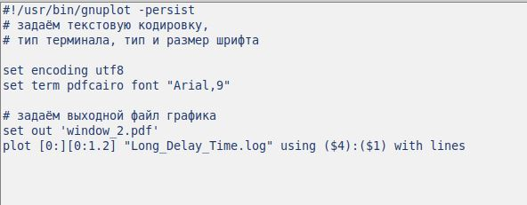{#fig:015 width=70%}

## Long Delay Time log

Значения Long Delay Time log 

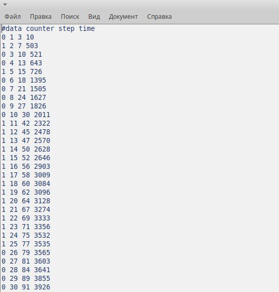{#fig:016 width=70%}

## значения задержки в очереди превышали

График в какие периоды значения задержки в очереди превышали заданное 

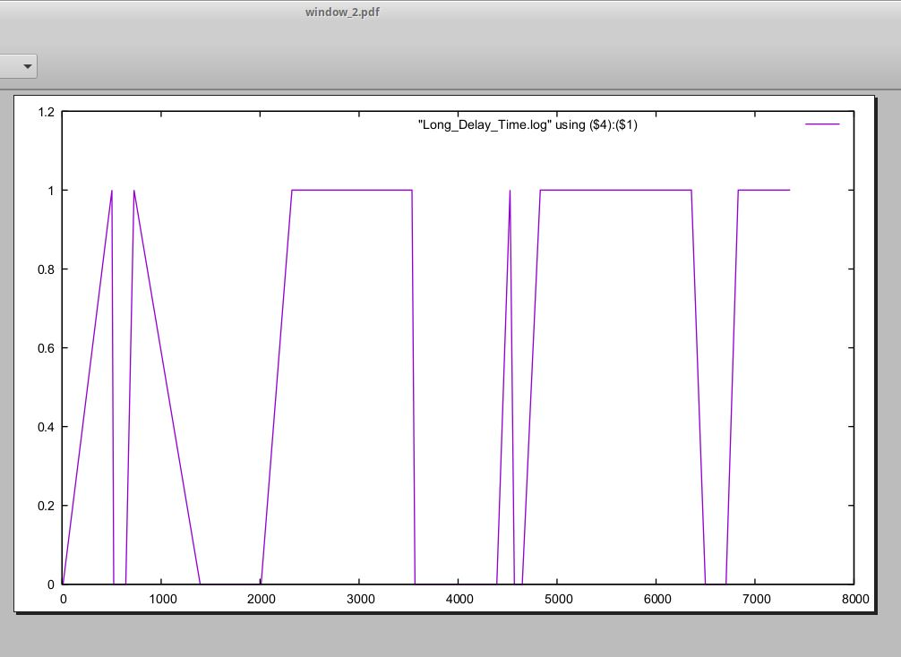{#fig:017 width=70%}

:::

