---
## Front matter
title: "Отчёт по лабораторной работе 11"
subtitle: "Модель системы массового обслуживания M|M|1"
author: "Наталья Андреевна Сидорова"

## Generic otions
lang: ru-RU
toc-title: "Содержание"

## Bibliography
bibliography: bib/cite.bib
csl: pandoc/csl/gost-r-7-0-5-2008-numeric.csl

## Pdf output format
toc: true # Table of contents
toc-depth: 2
lof: true # List of figures
lot: true # List of tables
fontsize: 12pt
linestretch: 1.5
papersize: a4
documentclass: scrreprt
## I18n polyglossia
polyglossia-lang:
  name: russian
  options:
	- spelling=modern
	- babelshorthands=true
polyglossia-otherlangs:
  name: english
## I18n babel
babel-lang: russian
babel-otherlangs: english
## Fonts
mainfont: IBM Plex Serif
romanfont: IBM Plex Serif
sansfont: IBM Plex Sans
monofont: IBM Plex Mono
mathfont: STIX Two Math
mainfontoptions: Ligatures=Common,Ligatures=TeX,Scale=0.94
romanfontoptions: Ligatures=Common,Ligatures=TeX,Scale=0.94
sansfontoptions: Ligatures=Common,Ligatures=TeX,Scale=MatchLowercase,Scale=0.94
monofontoptions: Scale=MatchLowercase,Scale=0.94,FakeStretch=0.9
mathfontoptions:
## Biblatex
biblatex: true
biblio-style: "gost-numeric"
biblatexoptions:
  - parentracker=true
  - backend=biber
  - hyperref=auto
  - language=auto
  - autolang=other*
  - citestyle=gost-numeric
## Pandoc-crossref LaTeX customization
figureTitle: "Рис."
tableTitle: "Таблица"
listingTitle: "Листинг"
lofTitle: "Список иллюстраций"
lotTitle: "Список таблиц"
lolTitle: "Листинги"
## Misc options
indent: true
header-includes:
  - \usepackage{indentfirst}
  - \usepackage{float} # keep figures where there are in the text
  - \floatplacement{figure}{H} # keep figures where there are in the text
---

# Цель работы

Смоделировать данную СМО в CPNTools.

# Выполнение лабораторной работы

Сеть Петри для самой системы, сервер и генератор заявок описываются отдельными сетями, также здесь есть позиции очередь и обслуженная заявка (рис. [-@fig:001]).

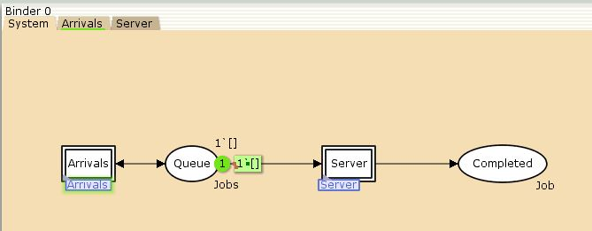{#fig:001 width=70%}

Сеть Петри для генератора заявок. Имеет позиции текущая заявка, следующая заявка и очередь. Два перехода: распределение поступления заявок и определение поступления заявки в очередь (рис. [-@fig:002]).

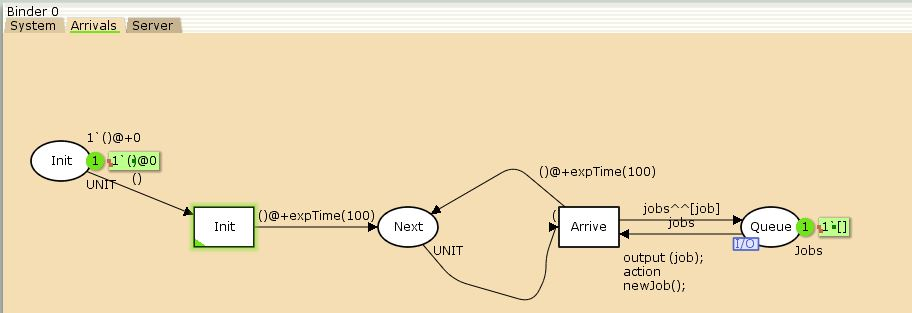{#fig:002 width=70%}

Сеть Петри для сервера. Имеет позиции: очередь, сервер занят, сервер простаивает и заявка выполнена. Переходы: старт и стоп работы сервера. (рис. [-@fig:003]).

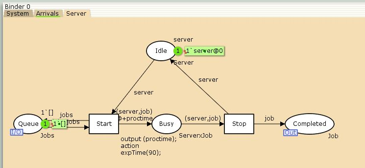{#fig:003 width=70%}

Декларации: определния множеств, инициализация переменных, объявление функций (рис. [-@fig:004]).

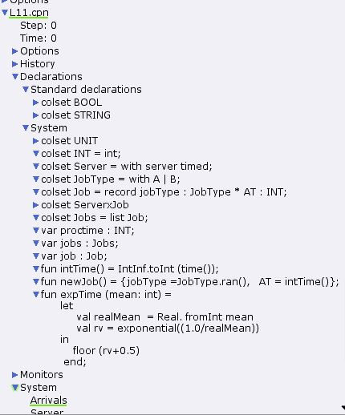{#fig:004 width=70%}

Моделирование системы (рис. [-@fig:007]).

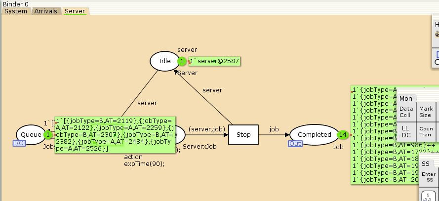{#fig:007 width=70%}

Мониторинг параметров очереди. Изменение функции Observer чтобы получить значение задержки в очереди (рис. [-@fig:005]).

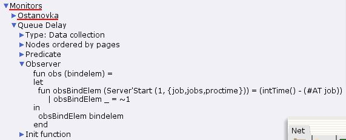{#fig:005 width=70%}

Изменение функции Predicate чтобы останавливать мониторинг (рис. [-@fig:006]).

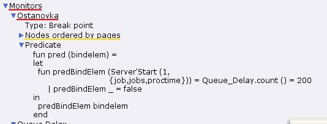{#fig:006 width=70%}

Значения файла Queue Delay.log, содержащие значение задержки очереди, счетчик, шаг, время (рис. [-@fig:008]).

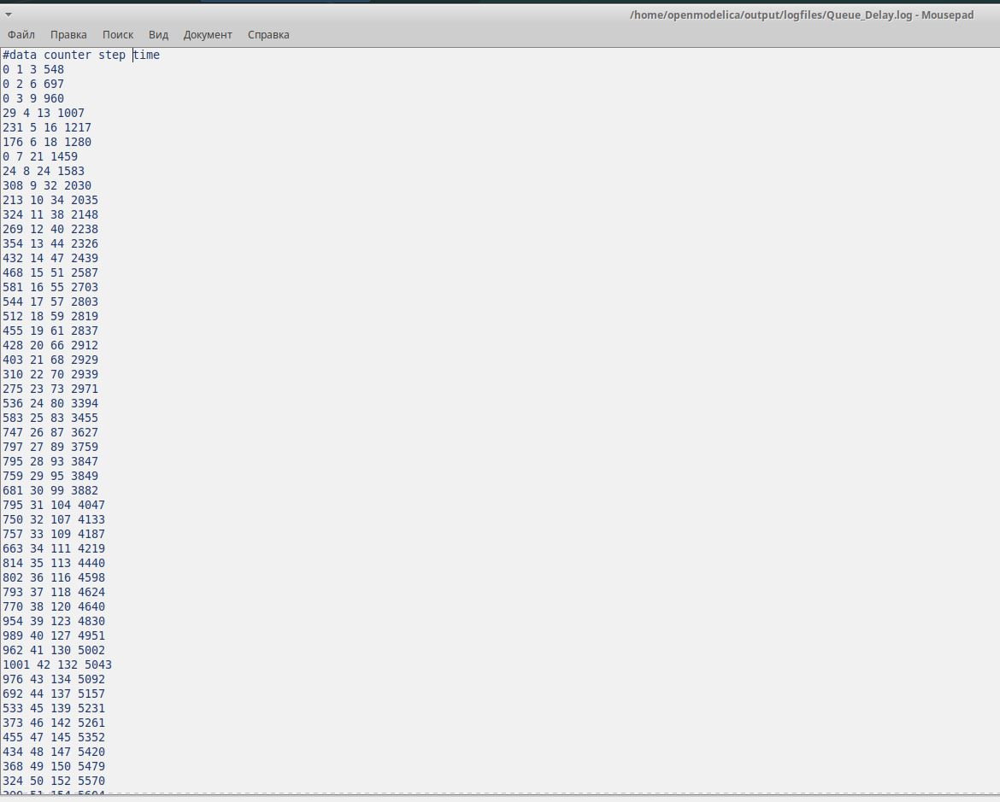{#fig:008 width=70%}

Код для создания графика задержки в очереди (рис. [-@fig:009]).

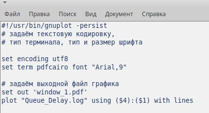{#fig:009 width=70%}

График задержки в очереди (рис. [-@fig:010]).

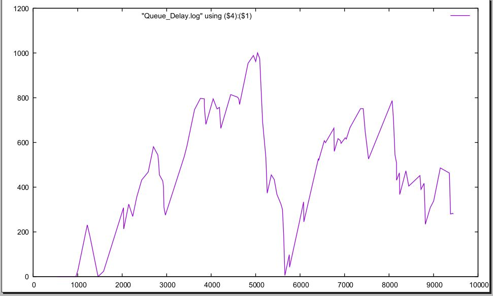{#fig:010 width=70%}

Добавляем монитор Queue Delay Real и изменяем функцию Observer для действительных значений (рис. [-@fig:011]).

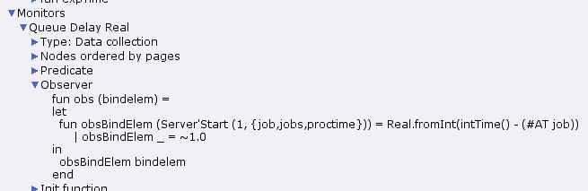{#fig:011 width=70%}

Значения Queue Delay Real.log (рис. [-@fig:012]).

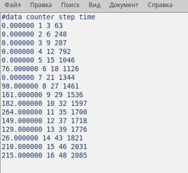{#fig:012 width=70%}

Добавляем монитор Long Delay Time и изменяем функцию Observer чтобы посчитать сколько раз задержка превысила заданное значение (рис. [-@fig:013]).

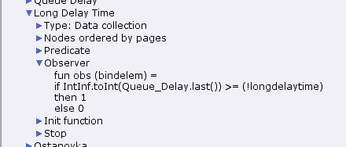{#fig:013 width=70%}

Добавляем новую переменную в декларации (рис. [-@fig:014]).

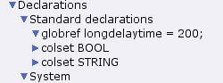{#fig:014 width=70%}

Код для графика в какие периоды значения задержки в очереди превышали заданное (рис. [-@fig:015]).

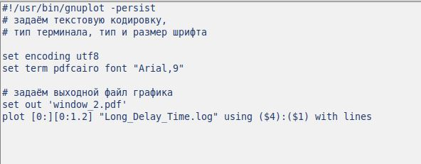{#fig:015 width=70%}

Значения Long Delay Time log (рис. [-@fig:016]).

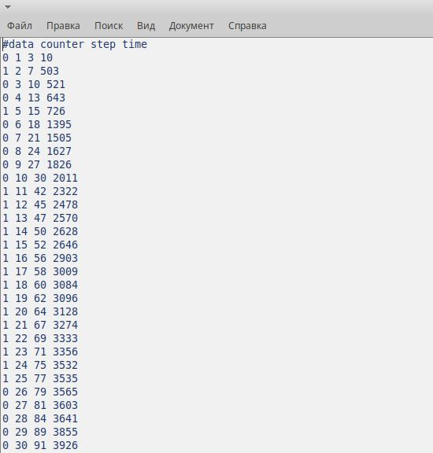{#fig:016 width=70%}

График в какие периоды значения задержки в очереди превышали заданное (рис. [-@fig:017]).

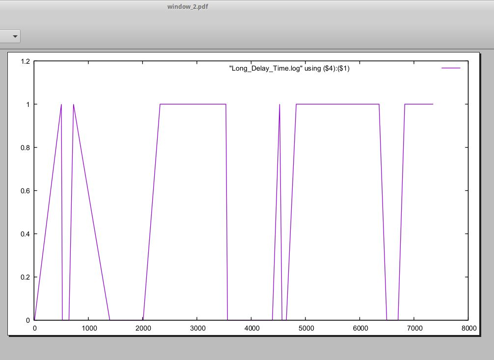{#fig:017 width=70%}

# Выводы

В ходе выполнения лабораторной работы я смоделировала систему массового обслуживания M|M|1 в CPNTools.

# Список литературы{.unnumbered}

::: {#refs}
:::
