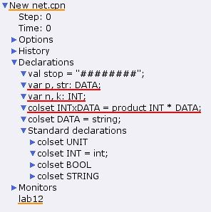
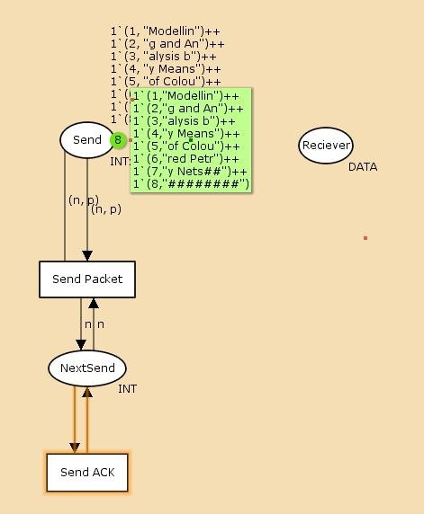
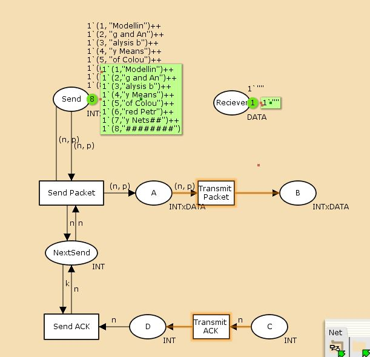
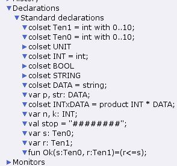
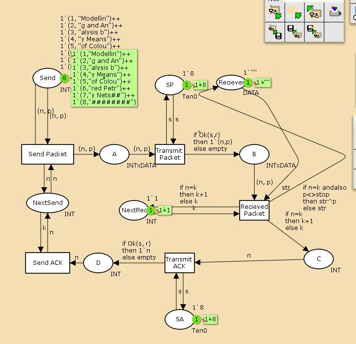
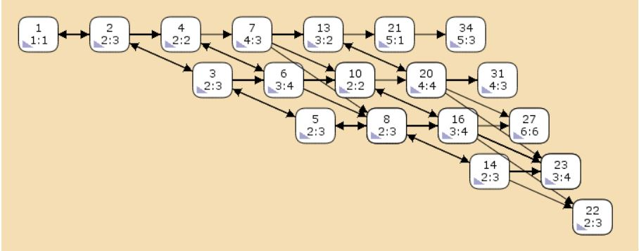
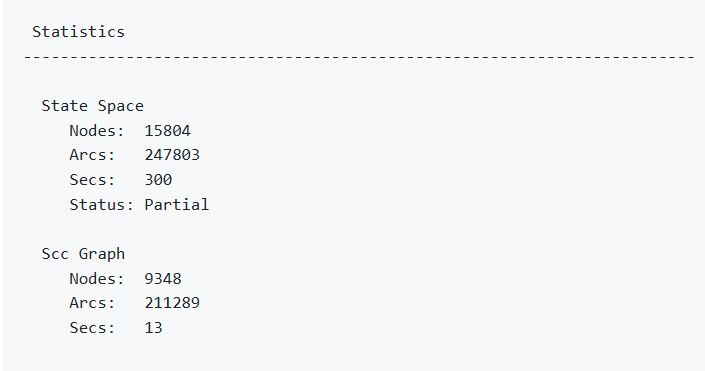
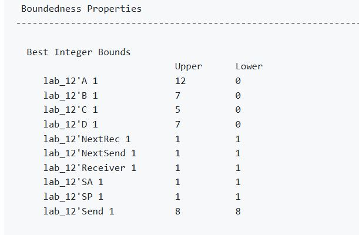
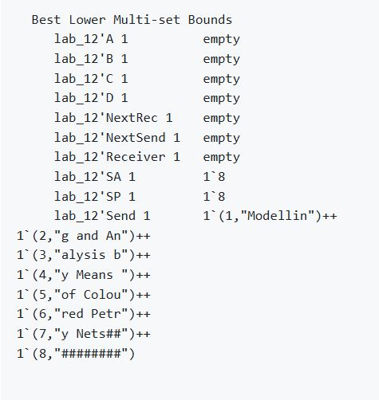
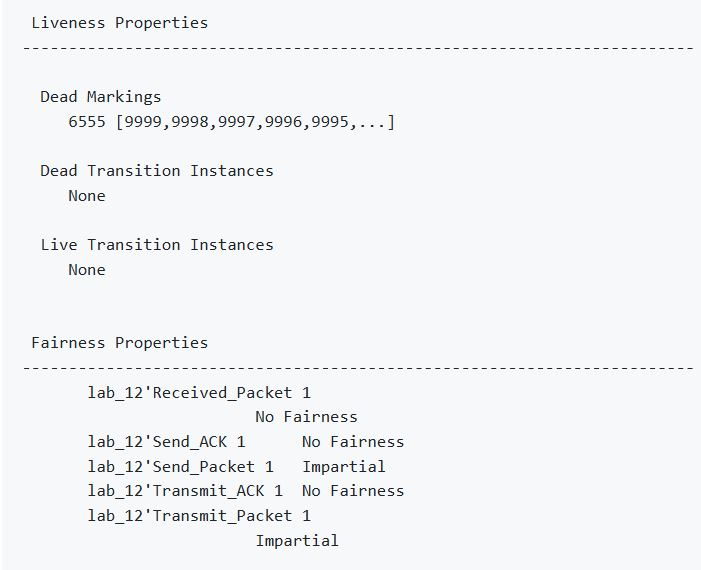

---
## Front matter
lang: ru-RU
title: Лабораторная работа 12
subtitle: Пример моделирования простого протокола передачи данных
author:
  - Сидорова Н.А.
institute:
  - Российский университет дружбы народов, Москва, Россия
  - Объединённый институт ядерных исследований, Дубна, Россия
date: 25 апреля 2025

## i18n babel
babel-lang: russian
babel-otherlangs: english

## Formatting pdf
toc: false
toc-title: Содержание
slide_level: 2
aspectratio: 169
section-titles: true
theme: metropolis
header-includes:
 - \metroset{progressbar=frametitle,sectionpage=progressbar,numbering=fraction}
---

## Декларации

{#fig:001 width=70%}

## начальный граф

{#fig:002 width=70%}

## промежуточные состояния

{#fig:003 width=70%}

## новые декларации

{#fig:004 width=70%}

## Готовая модель

{#fig:005 width=70%}

## Граф

{#fig:006 width=70%}

## Отчет пространства

В отчете состояний можно увидеть что есть 15804 состояния и 247803 перехода между ними, в графе строго соединенных компонент 9348 узлов и 211289 дуг. {#fig:007 width=70%}

## Отчет пространства

Затем указаны границы значений для каждого элемента: промежуточные состояния A, B, C, D(наибольшая верхняя граница у A, так как после него пакеты отбрасываются), вспомогательные состояния SP, SA, NextRec, NextSend, Receiver(в них может находиться только один пакет) и состояние Send(в нем хранится только 8 элементов, так как мы задали их в начале и с ними никаких изменений не происходит).

## Отчет пространства

{#fig:008 width=70%}

## Отчет пространства

{#fig:009 width=70%}

## Отчет пространства

Маркировка Home Markings равная None для всех состояний, так как модель где-то завершается и не входит в бесконечный цикл, при любых обстоятельствах во время выполнения модели процесса всегда можно достичь маркировки, где успешно передаётся вся информация и принимается подходящее решение.
Маркировка dead равная 6555 [9999,9998,9997,9996,9995,...] - это состояния, в которых не активированы никакие переходы.
В конце указано, что бесконечно часто могут происходить(Impartial Transition Instances) события Send_Packet и Transmit_Packet(они позволяют сети всегда передавать данные). Также указаны Transition Instances with No Fairness: Send_ACK, Transmit_ACK, Received_Packet. Это означает, что существует последовательность бесконечных срабатываний, в которой переход непрерывно включён с определённого момента, но больше не срабатывает.

## Отчет пространства

{#fig:010 width=70%}

:::

