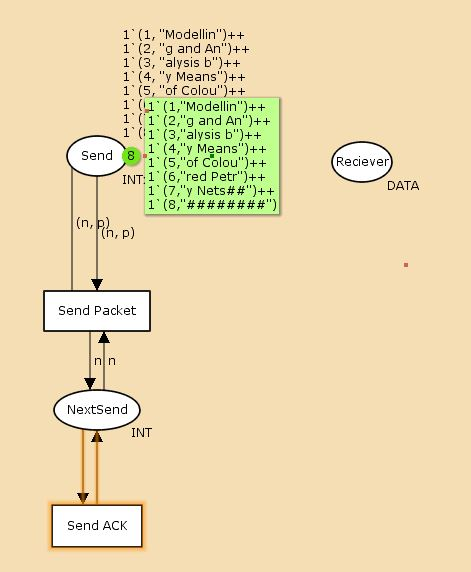

---
## Front matter
title: "Отчёт по лабораторной работе 12"
subtitle: "Пример моделирования простого протокола передачи данных"
author: "Наталья Андреевна Сидорова"

## Generic otions
lang: ru-RU
toc-title: "Содержание"

## Bibliography
bibliography: bib/cite.bib
csl: pandoc/csl/gost-r-7-0-5-2008-numeric.csl

## Pdf output format
toc: true # Table of contents
toc-depth: 2
lof: true # List of figures
lot: true # List of tables
fontsize: 12pt
linestretch: 1.5
papersize: a4
documentclass: scrreprt
## I18n polyglossia
polyglossia-lang:
  name: russian
  options:
	- spelling=modern
	- babelshorthands=true
polyglossia-otherlangs:
  name: english
## I18n babel
babel-lang: russian
babel-otherlangs: english
## Fonts
mainfont: IBM Plex Serif
romanfont: IBM Plex Serif
sansfont: IBM Plex Sans
monofont: IBM Plex Mono
mathfont: STIX Two Math
mainfontoptions: Ligatures=Common,Ligatures=TeX,Scale=0.94
romanfontoptions: Ligatures=Common,Ligatures=TeX,Scale=0.94
sansfontoptions: Ligatures=Common,Ligatures=TeX,Scale=MatchLowercase,Scale=0.94
monofontoptions: Scale=MatchLowercase,Scale=0.94,FakeStretch=0.9
mathfontoptions:
## Biblatex
biblatex: true
biblio-style: "gost-numeric"
biblatexoptions:
  - parentracker=true
  - backend=biber
  - hyperref=auto
  - language=auto
  - autolang=other*
  - citestyle=gost-numeric
## Pandoc-crossref LaTeX customization
figureTitle: "Рис."
tableTitle: "Таблица"
listingTitle: "Листинг"
lofTitle: "Список иллюстраций"
lotTitle: "Список таблиц"
lolTitle: "Листинги"
## Misc options
indent: true
header-includes:
  - \usepackage{indentfirst}
  - \usepackage{float} # keep figures where there are in the text
  - \floatplacement{figure}{H} # keep figures where there are in the text
---

# Цель работы

Реализовать в CPN Tools простой протокол передачи данных и провести анализ пространства состояний[@lab].

# Задание

1. Реализовать в CPN Tools простой протокол передачи данных[@cpn].
2. Вычислить пространство состояний, сформировать отчет о нем и построить граф.

# Выполнение лабораторной работы

Заполнили декларации для нашей модели, задали множества INT со значениями INT, DATA со значениями типа string, INTxDATA со значениями INT*DATA, задали стоп-строку и переменные n, k  типа INT, p, str типа DATA (рис. [-@fig:001]).

{#fig:001 width=70%}

Начальный граф: состояния Send, Receiver, NextSend и переходы SendPacket, SendACK (рис. [-@fig:002]).

{#fig:002 width=70%}

Добавили промежуточные состояния A, B, C, D и промежуточные переходы Trnsmit Packet, Transmit ACK (рис. [-@fig:003]).

{#fig:003 width=70%}

Новые декларации: два множества со списком целых чисел от 0 до 10 Ten0, Ten1. Переменные s и r, функция Ok (рис. [-@fig:004]).

{#fig:004 width=70%}

Полная модель (рис. [-@fig:005]).

{#fig:005 width=70%}

Граф пространства состояний (рис. [-@fig:006]).

{#fig:006 width=70%}

Отчет пространства состояний (рис. [-@fig:007]).

{#fig:007 width=70%}

Часть 2 (рис. [-@fig:008]).

{#fig:008 width=70%}

Часть 3 (рис. [-@fig:009]).

{#fig:009 width=70%}

Часть 4 (рис. [-@fig:010]).

{#fig:010 width=70%}

В отчете состояний можно увидеть что есть 15804 состояния и 247803 перехода между ними, в графе строго соединенных компонент 9348 узлов и 211289 дуг.
Затем указаны границы значений для каждого элемента: промежуточные состояния A, B, C, D(наибольшая верхняя граница у A, так как после него пакеты отбрасываются), вспомогательные состояния SP, SA, NextRec, NextSend, Receiver(в них может находиться только один пакет) и состояние Send(в нем хранится только 8 элементов, так как мы задали их в начале и с ними никаких изменений не происходит).
Также указаны границы в виде мультимножеств.
Маркировка Home Markings равная None для всех состояний, так как модель где-то завершается и не входит в бесконечный цикл, при любых обстоятельствах во время выполнения модели процесса всегда можно достичь маркировки, где успешно передаётся вся информация и принимается подходящее решение.
Маркировка dead равная 6555 [9999,9998,9997,9996,9995,...] - это состояния, в которых не активированы никакие переходы.
В конце указано, что бесконечно часто могут происходить(Impartial Transition Instances) события Send_Packet и Transmit_Packet(они позволяют сети всегда передавать данные). Также указаны Transition Instances with No Fairness: Send_ACK, Transmit_ACK, Received_Packet. Это означает, что существует последовательность бесконечных срабатываний, в которой переход непрерывно включён с определённого момента, но больше не срабатывает. .

Полный текст отчета: 
CPN Tools state space report for:
/home/openmodelica/Desktop/lab12.cpn
Report generated: Fri Mar 28 15:10:04 2025

 Statistics
------------------------------------------------------------------------

  State Space
     Nodes:  15804
     Arcs:   247803
     Secs:   300
     Status: Partial

  Scc Graph
     Nodes:  9348
     Arcs:   211289
     Secs:   13

 Boundedness Properties
------------------------------------------------------------------------

  Best Integer Bounds
                             Upper      Lower
     lab_12'A 1              12         0
     lab_12'B 1              7          0
     lab_12'C 1              5          0
     lab_12'D 1              7          0
     lab_12'NextRec 1        1          1
     lab_12'NextSend 1       1          1
     lab_12'Receiver 1       1          1
     lab_12'SA 1             1          1
     lab_12'SP 1             1          1
     lab_12'Send 1           8          8

  Best Upper Multi-set Bounds
     lab_12'A 1          12`(2,"g and An")++
9`(3,"alysis b")++
4`(4,"y Means ")
     lab_12'B 1          7`(2,"g and An")++
4`(3,"alysis b")++
2`(4,"y Means ")
     lab_12'C 1          5`3++
4`4++
2`5
     lab_12'D 1          1`2++
6`3++
3`4++
1`5
     lab_12'NextRec 1    1`3++
1`4++
1`5
     lab_12'NextSend 1   1`2++
1`3++
1`4
     lab_12'Receiver 1   1`"Modelling and An"++
1`"Modelling and Analysis b"++
1`"Modelling and Analysis by Means "
     lab_12'SA 1         1`8
     lab_12'SP 1         1`8
     lab_12'Send 1       1`(1,"Modellin")++
1`(2,"g and An")++
1`(3,"alysis b")++
1`(4,"y Means ")++
1`(5,"of Colou")++
1`(6,"red Petr")++
1`(7,"y Nets##")++
1`(8,"########")

  Best Lower Multi-set Bounds
     lab_12'A 1          empty
     lab_12'B 1          empty
     lab_12'C 1          empty
     lab_12'D 1          empty
     lab_12'NextRec 1    empty
     lab_12'NextSend 1   empty
     lab_12'Receiver 1   empty
     lab_12'SA 1         1`8
     lab_12'SP 1         1`8
     lab_12'Send 1       1`(1,"Modellin")++
1`(2,"g and An")++
1`(3,"alysis b")++
1`(4,"y Means ")++
1`(5,"of Colou")++
1`(6,"red Petr")++
1`(7,"y Nets##")++
1`(8,"########")

 Home Properties
------------------------------------------------------------------------

  Home Markings
     None

 Liveness Properties
------------------------------------------------------------------------

  Dead Markings
     6555 [9999,9998,9997,9996,9995,...]

  Dead Transition Instances
     None

  Live Transition Instances
     None

 Fairness Properties
------------------------------------------------------------------------
       lab_12'Received_Packet 1
                         No Fairness
       lab_12'Send_ACK 1      No Fairness
       lab_12'Send_Packet 1   Impartial
       lab_12'Transmit_ACK 1  No Fairness
       lab_12'Transmit_Packet 1
                         Impartial

# Выводы

В результате выполнения работы был реализован в CPN Tools простой протокол передачи данных и проведен анализ его пространства состояний.

# Список литературы{.unnumbered}

::: {#refs}
:::
