---
## Front matter
lang: ru-RU
title: Презентация к лабораторной работе 14
subtitle: Модели обработки заказов
author:
  - Сидорова Н.А.
institute:
  - Российский университет дружбы народов, Москва, Россия
  - Объединённый институт ядерных исследований, Дубна, Россия
date: 09 мая 2025

## i18n babel
babel-lang: russian
babel-otherlangs: english

## Formatting pdf
toc: false
toc-title: Содержание
slide_level: 2
aspectratio: 169
section-titles: true
theme: metropolis
header-includes:
 - \metroset{progressbar=frametitle,sectionpage=progressbar,numbering=fraction}
---

## код модели 1

Модель оформления заказов клиентов одним оператором 

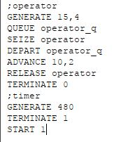{#fig:001 width=70%}

## Отчет 1

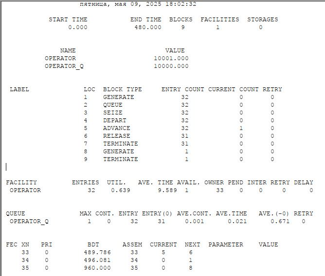{#fig:002 width=70%}

## код модели 1.2

Изменим интервалы поступления заказов и время оформления клиентов 

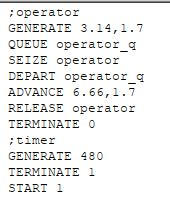{#fig:003 width=70%}

## Отчет 1.2

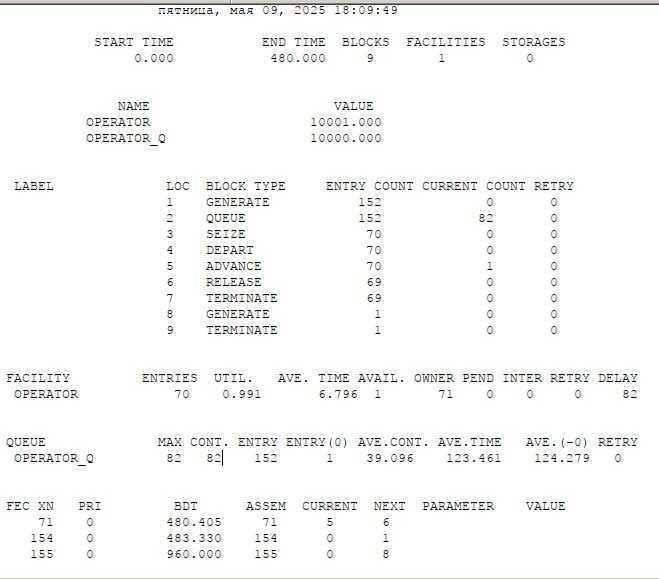{#fig:004 width=70%}

## код модели 2

Построение гистограммы распределения заявок в очереди 

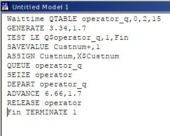{#fig:005 width=70%}

## Параметр

Добавление параметра 

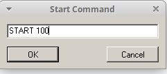{#fig:006 width=70%}

## Отчет 2

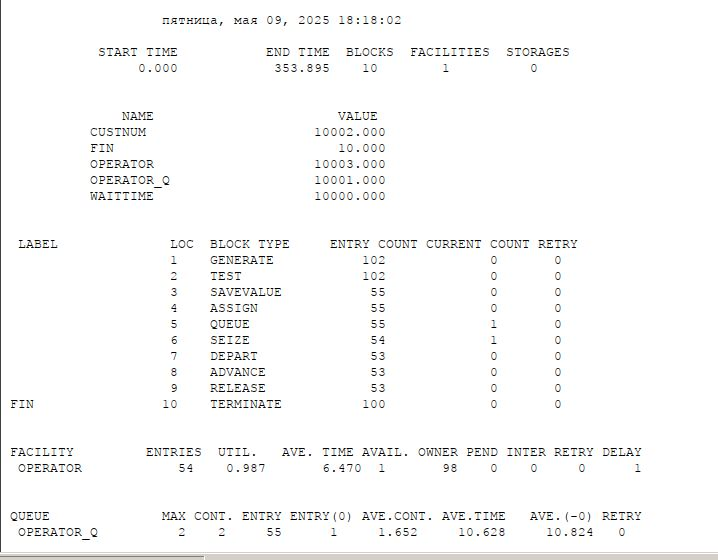{#fig:007 width=70%}

## Отчет 2

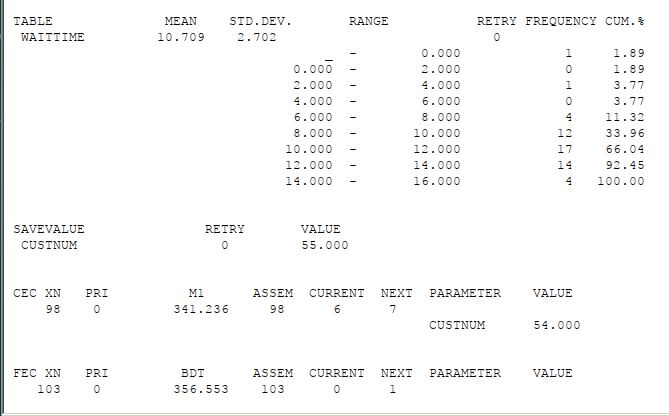{#fig:008 width=70%}

## График

Сама гистограмма 

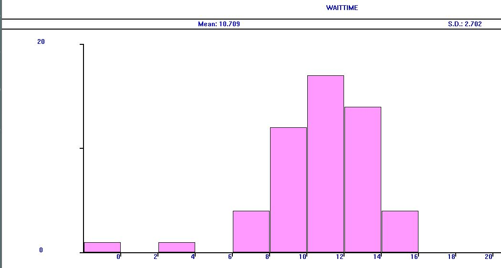{#fig:009 width=70%}

## код модели 3

Модель обслуживания двух типов заказов от клиентов в интернет магазине 

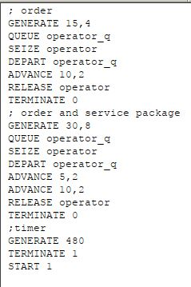{#fig:010 width=70%}

## Отчет 3

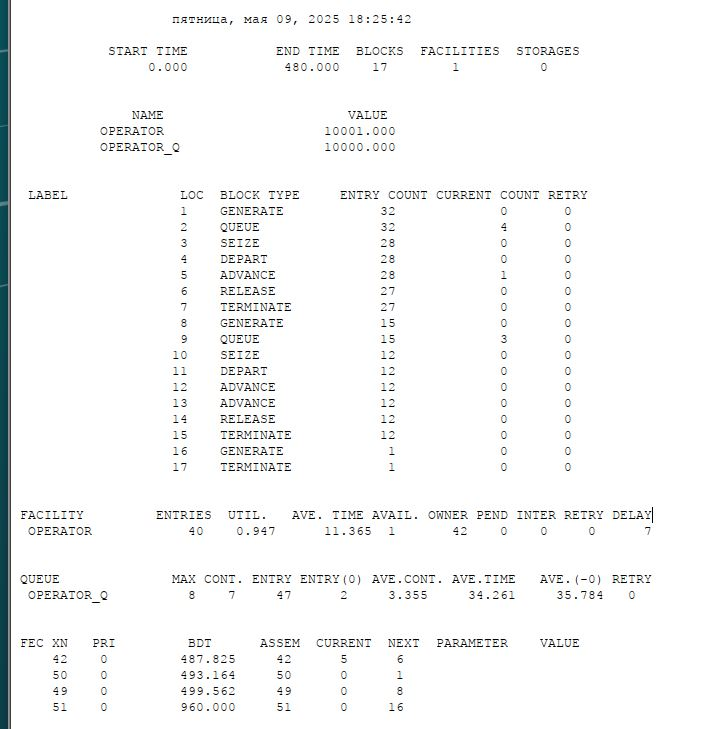{#fig:011 width=70%}

## код модели 3.1

Скорректируем модель так, чтобы учитывалось условие, что число заказов с дополнительным пакетом услуг составляет 30% от общего числа заказов.

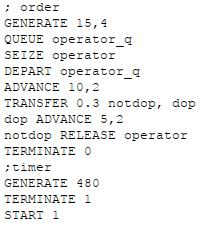{#fig:012 width=70%}

## Отчет 3.1

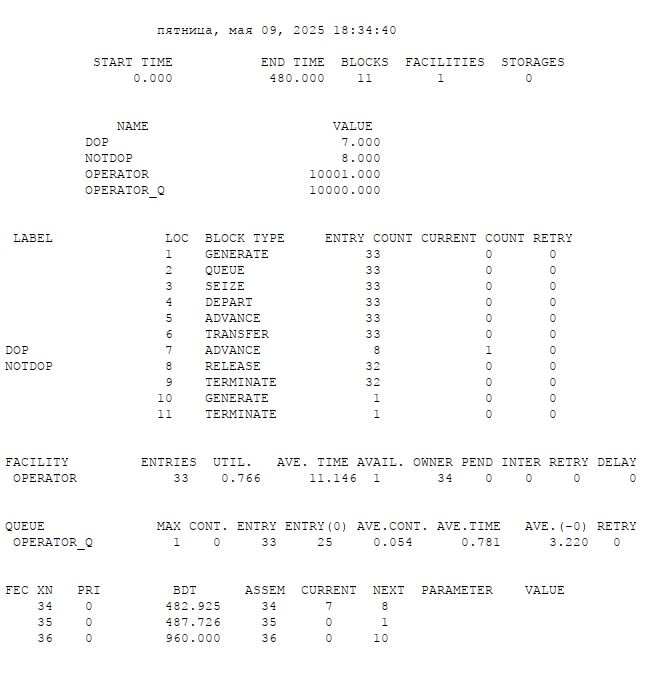{#fig:013 width=70%}

## код модели 4

Модель оформления заказов несколькими операторами 

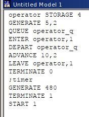{#fig:014 width=70%}

## Отчет 4

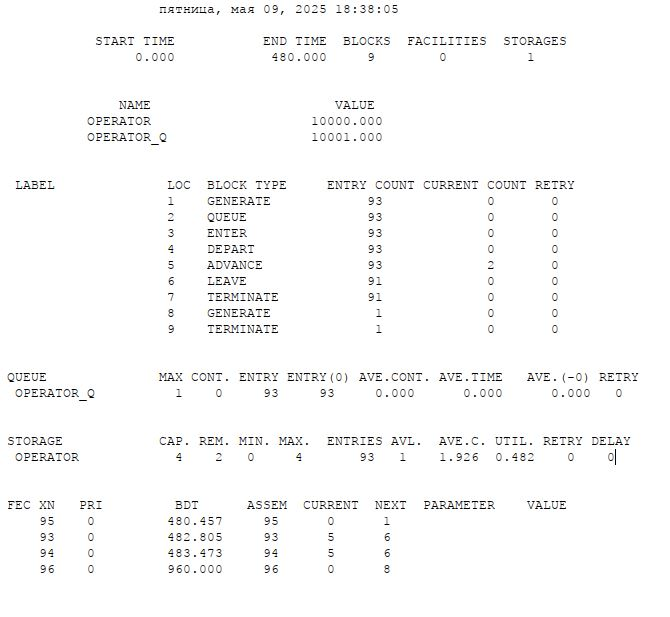{#fig:015 width=70%}

## код модели 4.1

требуется учесть в ней возможные отказы клиентов от заказа -- когда при подаче заявки на заказ клиент видит в очереди более двух других заявок, он отказывается от подачи заявки, то есть отказывается от обслуживания.
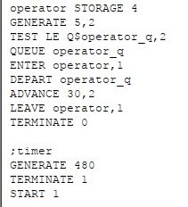{#fig:016 width=70%}

## Отчет 4.1

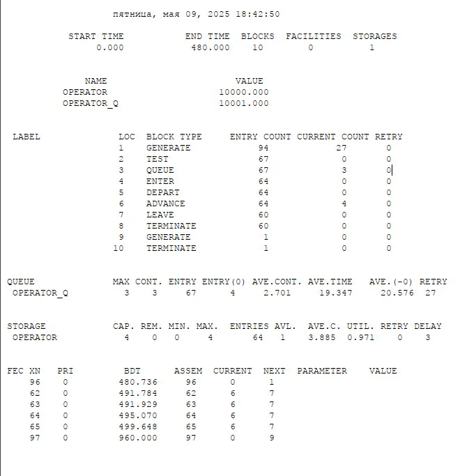{#fig:017 width=70%}

:::

