---
## Front matter
title: "Отчёт по лабораторной работе 14"
subtitle: "Модели обработки заказов"
author: "Сидорова Наталья Андреевна"

## Generic otions
lang: ru-RU
toc-title: "Содержание"

## Bibliography
bibliography: bib/cite.bib
csl: pandoc/csl/gost-r-7-0-5-2008-numeric.csl

## Pdf output format
toc: true # Table of contents
toc-depth: 2
lof: true # List of figures
lot: true # List of tables
fontsize: 12pt
linestretch: 1.5
papersize: a4
documentclass: scrreprt
## I18n polyglossia
polyglossia-lang:
  name: russian
  options:
	- spelling=modern
	- babelshorthands=true
polyglossia-otherlangs:
  name: english
## I18n babel
babel-lang: russian
babel-otherlangs: english
## Fonts
mainfont: IBM Plex Serif
romanfont: IBM Plex Serif
sansfont: IBM Plex Sans
monofont: IBM Plex Mono
mathfont: STIX Two Math
mainfontoptions: Ligatures=Common,Ligatures=TeX,Scale=0.94
romanfontoptions: Ligatures=Common,Ligatures=TeX,Scale=0.94
sansfontoptions: Ligatures=Common,Ligatures=TeX,Scale=MatchLowercase,Scale=0.94
monofontoptions: Scale=MatchLowercase,Scale=0.94,FakeStretch=0.9
mathfontoptions:
## Biblatex
biblatex: true
biblio-style: "gost-numeric"
biblatexoptions:
  - parentracker=true
  - backend=biber
  - hyperref=auto
  - language=auto
  - autolang=other*
  - citestyle=gost-numeric
## Pandoc-crossref LaTeX customization
figureTitle: "Рис."
tableTitle: "Таблица"
listingTitle: "Листинг"
lofTitle: "Список иллюстраций"
lotTitle: "Список таблиц"
lolTitle: "Листинги"
## Misc options
indent: true
header-includes:
  - \usepackage{indentfirst}
  - \usepackage{float} # keep figures where there are in the text
  - \floatplacement{figure}{H} # keep figures where there are in the text
---

# Цель работы

Реализовать разные модели обслуживания клиентов и провести анализ результатов[@lab].

# Задание

Реализовать с помощью gpss[@gpss]:

1. модель оформления заказов клиентов одним оператором с разными входными данными
2. построение гистограммы распределения заявок в очереди
3. модель обслуживания двух типов заказов от клиентов в интернет-магазине
4. модель оформления заказов несколькими операторами

# Теоретическое введение

Модель оформления заказов клиентов одним оператором.
Порядок блоков в модели соответствует порядку фаз обработки заказа в реальной системе:

1. клиент оставляет заявку на заказ в интернет-магазине;
2. если необходимо, заявка от клиента ожидает в очереди освобождения оператора для оформления заказа;
3. заявка от клиента принимается оператором для оформления заказа;
4. оператор оформляет заказ;
5. клиент получает подтверждение об оформлении заказа (покидает систему).

Модель будет состоять из двух частей: моделирование обработки заказов в интернет-магазине и задание времени моделирования.
Для задания равномерного распределения поступления заказов используем блок GENERATE, для задания равномерного времени обслуживания (задержки в системе) -- ADVANCE. Для моделирования ожидания заявок клиентов в очереди используем блоки QUEUE и DEPART, в которых в качестве имени очереди укажем operator_q Для моделирования поступления заявок для оформления заказов к оператору используем блоки SEIZE и RELEASE с параметром operator — имени «устройства обслуживания».
Требуется, чтобы модельное время было 8 часов. Соответственно, параметр блока GENERATE -- 480 (8 часов по 60 минут, всего 480 минут). Работа программы начи- нается с оператора START с начальным значением счётчика завершений, равным 1; заканчивается -- оператором TERMINATE с параметром 1, что задаёт ординарность потока в модели.

Построение гистограммы распределения заявок в очереди.
Требуется построить гистограмму распределения заявок, ожидающих обработки в очереди в примере из предыдущего упражнения. Для построения гистограммы необходимо сформировать таблицу значений заявок в очереди, записываемых в неё с определённой частотой.
Команда описания такой таблицы QTABLE имеет следующий формат: Name QTABLE A,B,C,D. Здесь Name -- метка, определяющая имя таблицы. Далее должны быть заданы операнды: А задается элемент данных, чьё частотное распределение будет заноситься в таблицу (может быть именем, выражением в скобках или системным числовым атрибутом (СЧА)); B задается верхний предел первого частотного интервала; С задает ширину частотного интервала — разницу между верхней и нижней границей каждого частотного класса; D задаёт число частотных интервалов.

Модель обслуживания двух типов заказов от клиентов в интернет-магазине.
Необходимо реализовать отличие в оформлении обычных заказов и заказов с дополнительным пакетом услуг. Такую систему можно промоделировать с помощью двух сегментов. Один из них моделирует оформление обычных заказов, а второй -- заказов с дополнительным пакетом услуг. В каждом из сегментов пара QUEUE–DEPART должна описывать одну и ту же очередь, а пара блоков SEIZE–RELEASE должна описывать в каждом из двух сегментов одно и то же устройство и моделировать работу оператора. 

Модель оформления заказов несколькими операторами.
В интернет-магазине заказы принимают 4 оператора. Интервалы поступления заказов распределены равномерно с интервалом 5 ± 2 мин. Время оформления заказа каждым оператором также распределено равномерно на интервале 10 ± 2 мин. обработка поступивших заказов происходит в порядке очереди (FIFO). Требуется определить характеристики очереди заявок на оформление заказов при условии, что заявка может обрабатываться одним из 4-х операторов в течение восьмичасового рабочего дня.
С помощью строки operator STORAGE 4 указываем, что у нас 4 оператора, затем к обычной процедуре генерации и обработки заявки добавляется, что заявку обрабатывает один оператор operator,1, сегмент моделирования времени остается без изменений

# Выполнение лабораторной работы

Модель оформления заказов клиентов одним оператором (рис. [-@fig:001]).

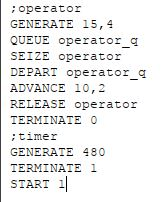{#fig:001 width=70%}

Отчет о симуляции (рис. [-@fig:002]).

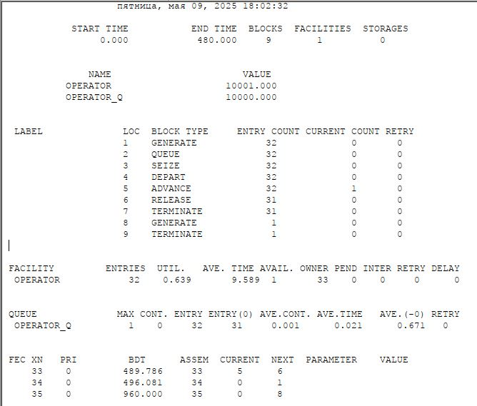{#fig:002 width=70%}

Изменим интервалы поступления заказов и время оформления клиентов (рис. [-@fig:003]).

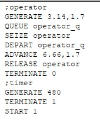{#fig:003 width=70%}

Отчет (рис. [-@fig:004]).

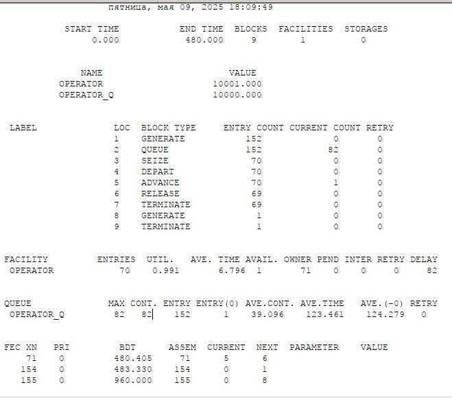{#fig:004 width=70%}

Построение гистограммы распределения заявок в очереди (рис. [-@fig:005]).

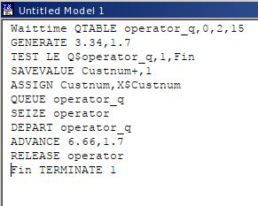{#fig:005 width=70%}

Добавление параметра (рис. [-@fig:006]).

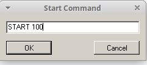{#fig:006 width=70%}

Отчет (рис. [-@fig:007]).

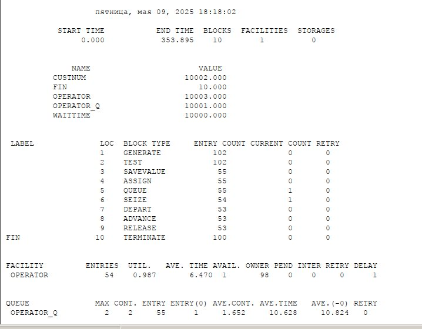{#fig:007 width=70%}

Вторая часть отчета (рис. [-@fig:008]).

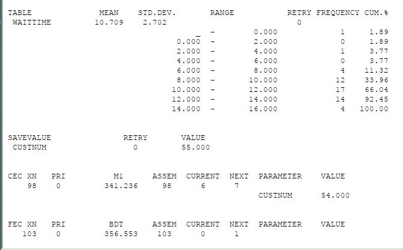{#fig:008 width=70%}

Сама гистограмма (рис. [-@fig:009]).

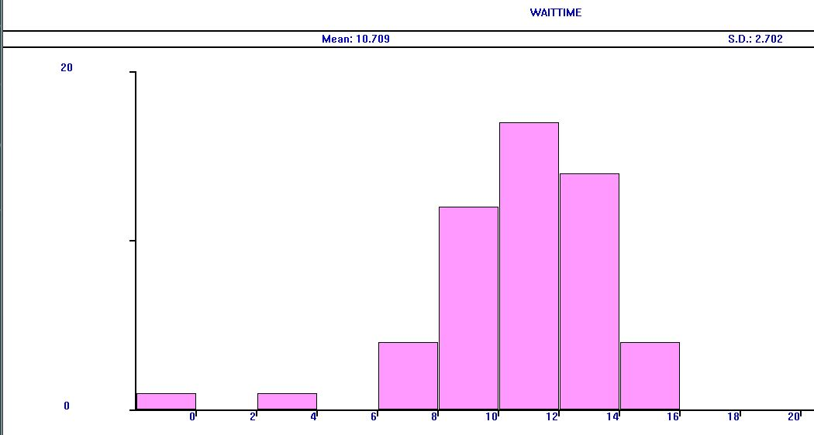{#fig:009 width=70%}

Модель обслуживания двух типов заказов от клиентов в интернет магазине (рис. [-@fig:010]).

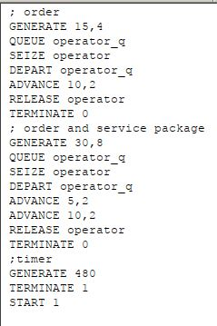{#fig:010 width=70%}

Отчет (рис. [-@fig:011]).

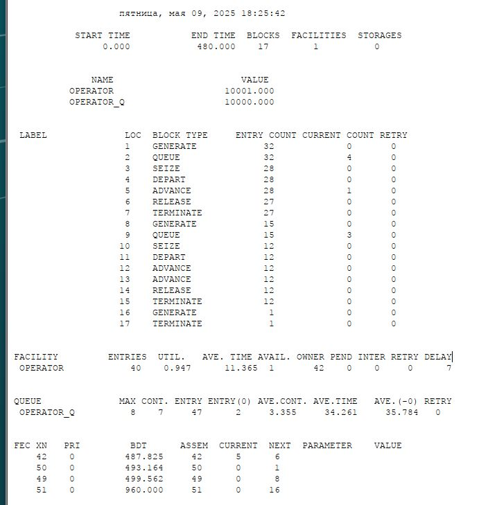{#fig:011 width=70%}

Скорректируем модель так, чтобы учитывалось условие, что число заказов с дополнительным пакетом услуг составляет 30% от общего числа заказов.(рис. [-@fig:012]).

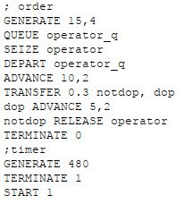{#fig:012 width=70%}

Отчет (рис. [-@fig:013]).

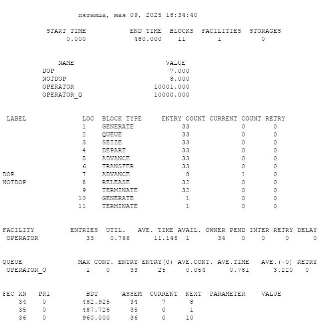{#fig:013 width=70%}

Модель оформления заказов несколькими операторами (рис. [-@fig:014]).

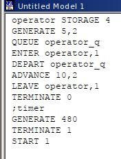{#fig:014 width=70%}

Отчет (рис. [-@fig:015]).

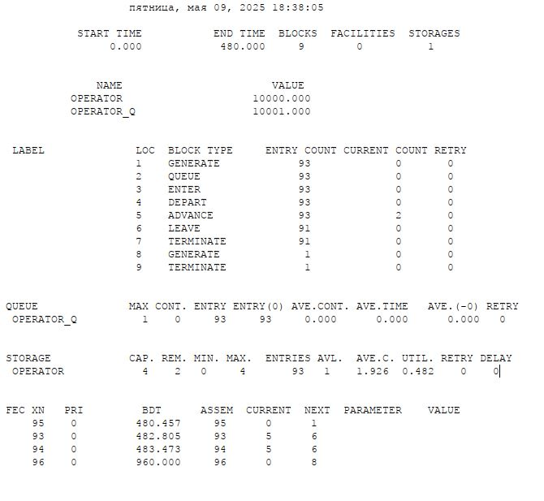{#fig:015 width=70%}

Изменим модель: требуется учесть в ней возможные отказы клиентов от заказа -- когда при подаче заявки на заказ клиент видит в очереди более двух других заявок, он отказывается от подачи заявки, то есть отказывается от обслуживания (используем блок TEST и стандартный числовой атрибут Qj текущей длины очереди j). Добавим строчку TEST LE Q$operator_q,2, которая проверяет больше ли в очереди клиентов, чем два, если нет -- клиент поступает на обработку, иначе уходит. Также в ранее проанализированном отчете видно, что клиентов в очереди не было больше 2, поэтому увеличим время обработки заказов до 30 ± 2 мин., чтобы проверить результаты изменений модели (рис. [-@fig:016]).

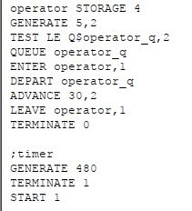{#fig:016 width=70%}

Отчет (рис. [-@fig:017]).

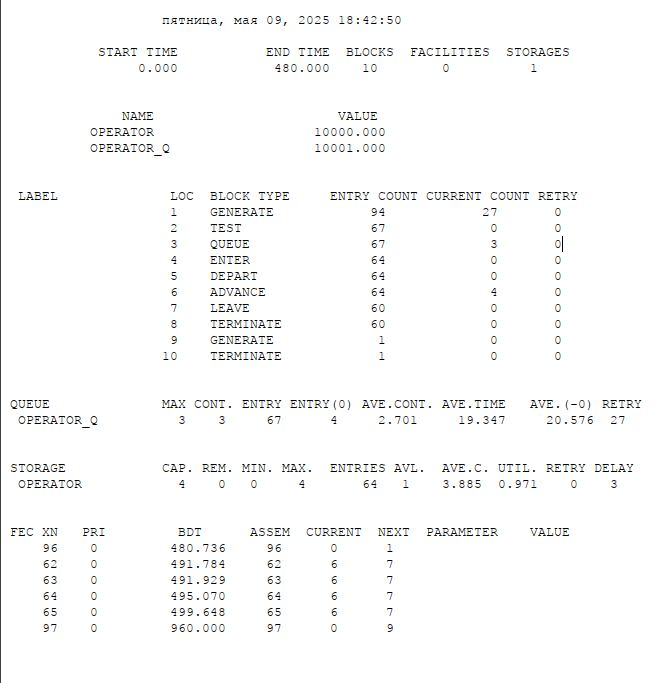{#fig:017 width=70%}

# Выводы

В результате выполнения работы были реализованы с помощью gpss:

1. модель оформления заказов клиентов одним оператором с разными входными данными
2. построение гистограммы распределения заявок в очереди
3. модель обслуживания двух типов заказов от клиентов в интернет-магазине
4. модель оформления заказов несколькими операторами.

# Список литературы{.unnumbered}

::: {#refs}
:::
