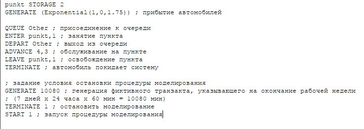
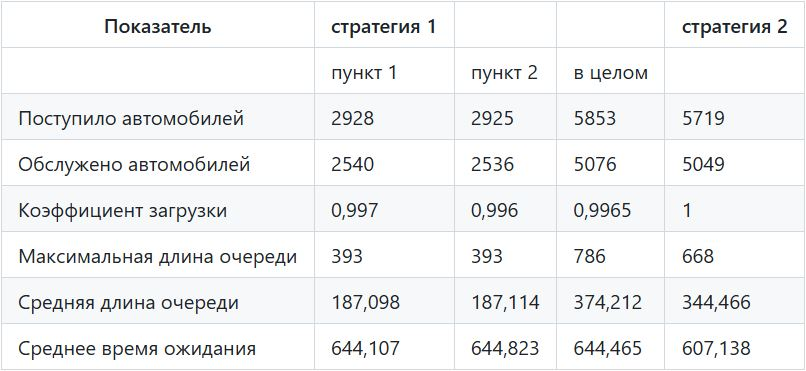
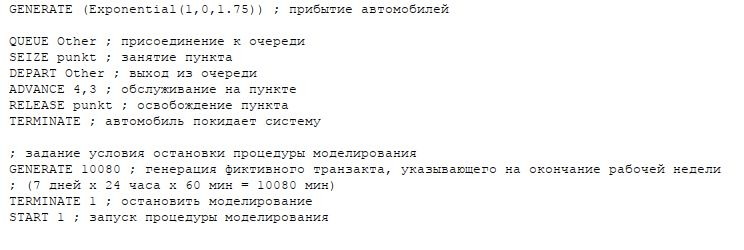
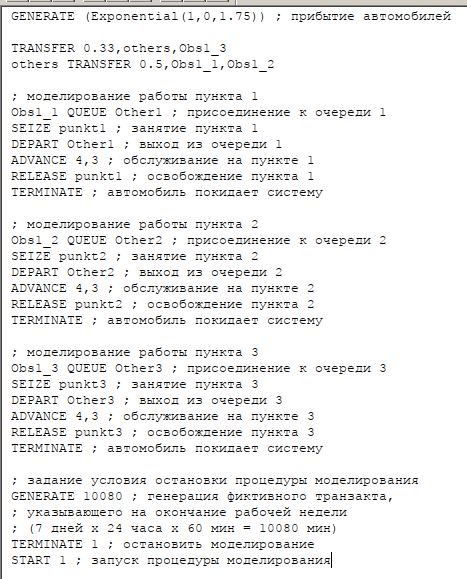
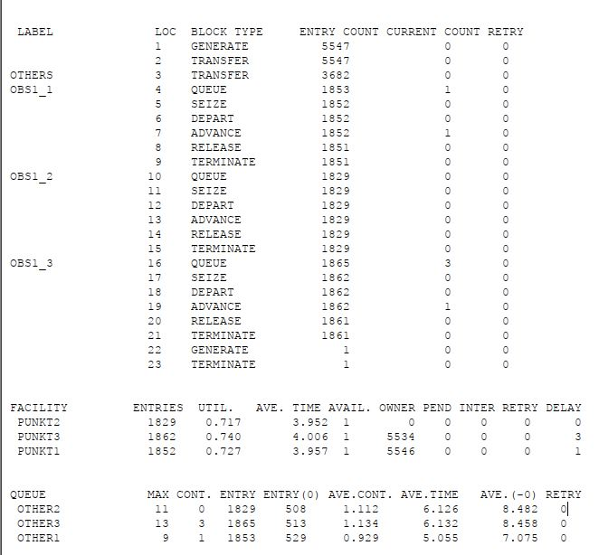
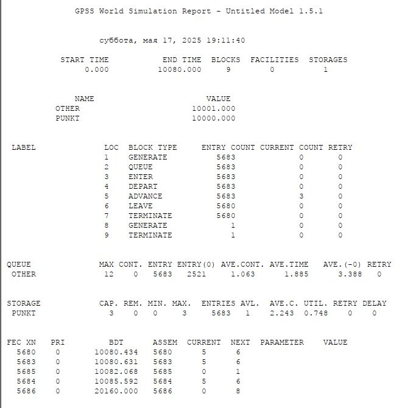
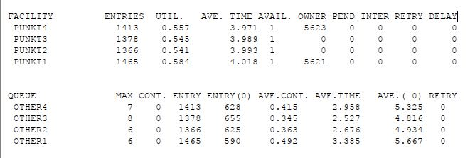
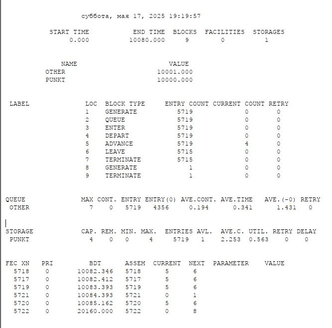

---
## Front matter
lang: ru-RU
title: Презентация к лабораторной работе 16
subtitle: Задачи оптимизации. Модель двух стратегий обслуживания
author:
  - Сидорова Н.А.
institute:
  - Российский университет дружбы народов, Москва, Россия
  - Объединённый институт ядерных исследований, Дубна, Россия
date: 17 мая 2025

## i18n babel
babel-lang: russian
babel-otherlangs: english

## Formatting pdf
toc: false
toc-title: Содержание
slide_level: 2
aspectratio: 169
section-titles: true
theme: metropolis
header-includes:
 - \metroset{progressbar=frametitle,sectionpage=progressbar,numbering=fraction}
---

## 1 стратегия, 2 пункта

{#fig:001 width=70%}

## Отчет

{#fig:002 width=70%}

## 2 стратегия, 1 пункт

{#fig:003 width=70%}

## Отчет

{#fig:004 width=70%}

## Таблица

{#fig:015 width=70%}

## обе стратегии, 1 пункт

{#fig:005 width=70%}

## Отчет

{#fig:006 width=70%}

## 1 стратегия, 3 пункта

{#fig:007 width=70%}

## Отчет

{#fig:008 width=70%}

## 2 стратегия, 3 пункта

{#fig:009 width=70%}

## Отчет

{#fig:010 width=70%}

## 1 стратегия, 4 пункта

{#fig:011 width=70%}

## Отчет

{#fig:012 width=70%}

## 2 стратегия, 4 пункта

{#fig:013 width=70%}

## Отчет

{#fig:014 width=70%}

  

:::

