---
## Front matter
title: "Отчёт по лабораторной работе 16"
subtitle: "Задачи оптимизации. Модель двух стратегий обслуживания"
author: "Наталья Андреевна Сидорова"

## Generic otions
lang: ru-RU
toc-title: "Содержание"

## Bibliography
bibliography: bib/cite.bib
csl: pandoc/csl/gost-r-7-0-5-2008-numeric.csl

## Pdf output format
toc: true # Table of contents
toc-depth: 2
lof: true # List of figures
lot: true # List of tables
fontsize: 12pt
linestretch: 1.5
papersize: a4
documentclass: scrreprt
## I18n polyglossia
polyglossia-lang:
  name: russian
  options:
	- spelling=modern
	- babelshorthands=true
polyglossia-otherlangs:
  name: english
## I18n babel
babel-lang: russian
babel-otherlangs: english
## Fonts
mainfont: IBM Plex Serif
romanfont: IBM Plex Serif
sansfont: IBM Plex Sans
monofont: IBM Plex Mono
mathfont: STIX Two Math
mainfontoptions: Ligatures=Common,Ligatures=TeX,Scale=0.94
romanfontoptions: Ligatures=Common,Ligatures=TeX,Scale=0.94
sansfontoptions: Ligatures=Common,Ligatures=TeX,Scale=MatchLowercase,Scale=0.94
monofontoptions: Scale=MatchLowercase,Scale=0.94,FakeStretch=0.9
mathfontoptions:
## Biblatex
biblatex: true
biblio-style: "gost-numeric"
biblatexoptions:
  - parentracker=true
  - backend=biber
  - hyperref=auto
  - language=auto
  - autolang=other*
  - citestyle=gost-numeric
## Pandoc-crossref LaTeX customization
figureTitle: "Рис."
tableTitle: "Таблица"
listingTitle: "Листинг"
lofTitle: "Список иллюстраций"
lotTitle: "Список таблиц"
lolTitle: "Листинги"
## Misc options
indent: true
header-includes:
  - \usepackage{indentfirst}
  - \usepackage{float} # keep figures where there are in the text
  - \floatplacement{figure}{H} # keep figures where there are in the text
---

# Цель работы

Реализовать с помощью gpss модель двух стратегий обслуживания и оценить оптимальные параметры[@lab].

# Задание

Реализовать с помощью gpss[@gpss]:

1. модель с двумя очередями;
2. модель с одной очередью;
3. изменить модели, чтобы определить оптимальное число пропускных пунктов.

# Теоретическое введение

На пограничном контрольно-пропускном пункте транспорта имеются 2 пункта пропуска. Интервалы времени между поступлением автомобилей имеют экспоненциальное распределение со средним значением μ . Время прохождения автомобилями пограничного контроля имеет равномерное распределение на интервале [ a , b ] . Предлагается две стратегии обслуживания прибывающих автомобилей:

1. автомобили образуют две очереди и обслуживаются соответствующими пунктами пропуска;
2. автомобили образуют одну общую очередь и обслуживаются освободившимся пунктом пропуска.

Исходные данные: μ = 1, 75 мин, a = 1 мин, b = 7 мин.

Целью моделирования является определение:

1. характеристик качества обслуживания автомобилей, в частности, средних длин очередей; среднего времени обслуживания автомобиля; среднего времени пребывания автомобиля на пункте пропуска;
2. наилучшей стратегии обслуживания автомобилей на пункте пограничного контроля;
3. оптимального количества пропускных пунктов.

В качестве критериев, используемых для сравнения стратегий обслуживания автомобилей, выберем:

1. коэффициенты загрузки системы;
2. максимальные и средние длины очередей;
3. средние значения времени ожидания обслуживания.

# Выполнение лабораторной работы

Первая стратегия обслуживания, когда прибывающие автомобили образуют две очереди и обслуживаются соответствующими двумя пропускными пунктами  (рис. [-@fig:001]).

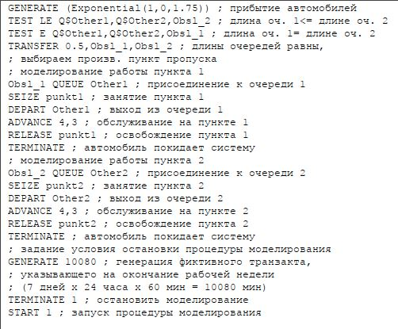{#fig:001 width=70%}

Отчет (рис. [-@fig:002]).

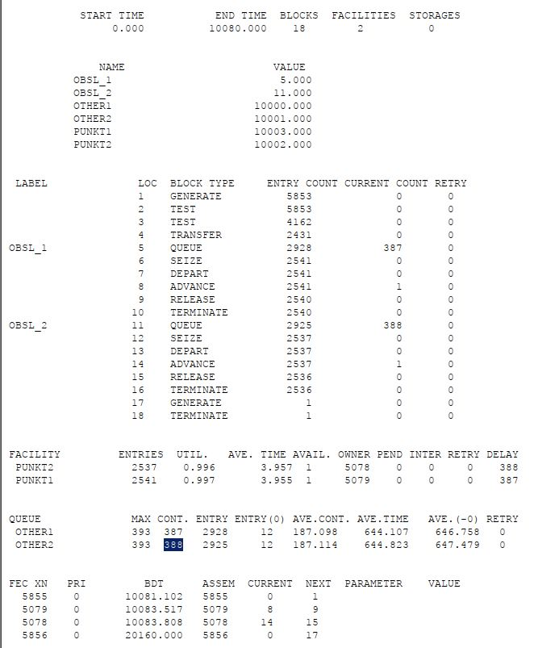{#fig:002 width=70%}

Вторая стратегия обслуживания, когда прибывающие автомобили образуют одну очередь и обслуживаются освободившимся пропускным пунктом (рис. [-@fig:003]).

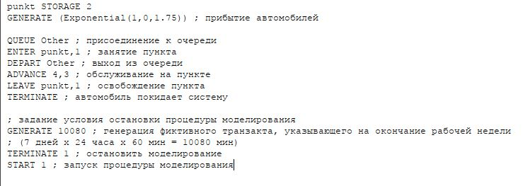{#fig:003 width=70%}

Отчет (рис. [-@fig:004]).

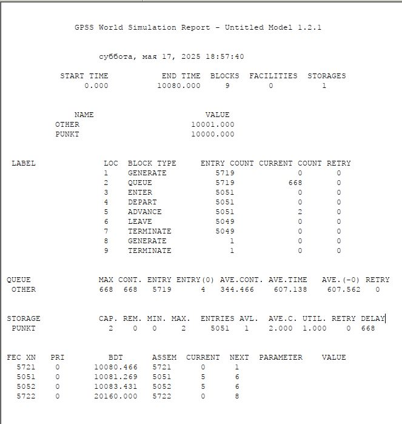{#fig:004 width=70%}

Сравнительная таблица. Сравнив результаты моделирования двух систем, можно сделать вывод о том, что первая модель позволяет обслужить большее число автомобилей. Однако мы видим, что разница между обслуженными и поступившими автомобилями меньше для второй модели – значит, продуктивность работы выше. Также для второй модели коэффициент загрузки равен 1 -- значит ни один из пунктов не простаивает. Максимальная длина очереди, средняя длина очереди и среднее время ожидания меньше для второй стратегии. Можно сделать вывод, что вторая стратегия лучше. (рис. [-@fig:015]).

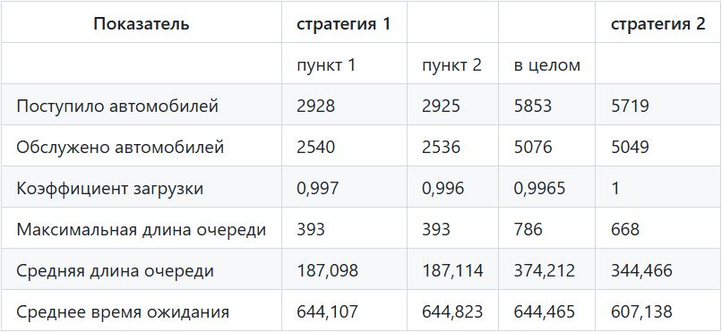{#fig:015 width=70%}

Изменим модели, чтобы определить оптимальное число пропускных пунктов (от 1 до 4). Будем подбирать под следующие критерии:

1. коэффициент загрузки пропускных пунктов принадлежит интервалу [0, 5; 0, 95];
2. среднее число автомобилей, одновременно находящихся на контрольно пропускном пункте, не должно превышать 3;
3. среднее время ожидания обслуживания не должно превышать 4 мин.
 Для обеих стратегий модель с одним пунктом выглядит одинаково  (рис. [-@fig:005]).

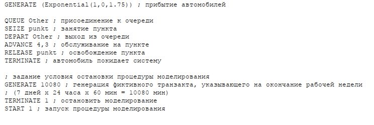{#fig:005 width=70%}

Отчет. В этом случае модель не проходит ни по одному из критериев, так как коэффициент загрузки, размер очереди и среднее время ожидания больше  (рис. [-@fig:006]).

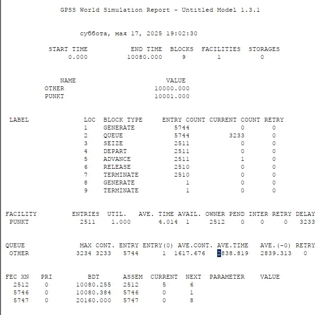{#fig:006 width=70%}

Построим модель для первой стратегии с 3 пропускными пунктами  (рис. [-@fig:007]).

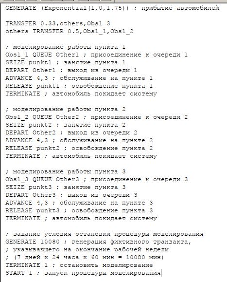{#fig:007 width=70%}

Отчет. В этом случае среднее время ожидания больше 4.  (рис. [-@fig:008]).

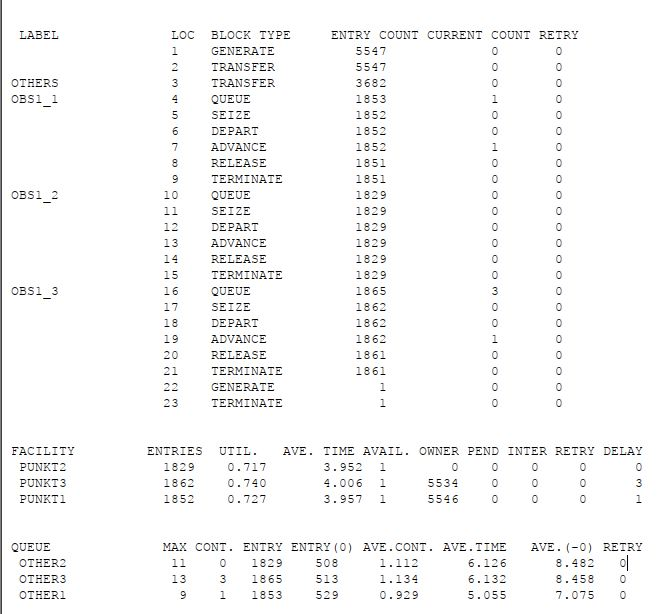{#fig:008 width=70%}

Построим модель для второй стратегии с 3 пропускными пунктами (рис. [-@fig:009]).

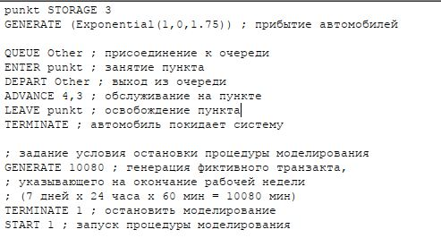{#fig:009 width=70%}

Отчет. В этом случае все критерии выполняются, поэтому модель оптимальна. (рис. [-@fig:010]).

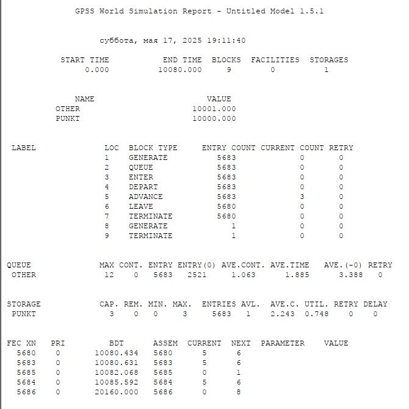{#fig:010 width=70%}

Построим модель для первой стратегии с 4 пропускными пунктами  (рис. [-@fig:011]).

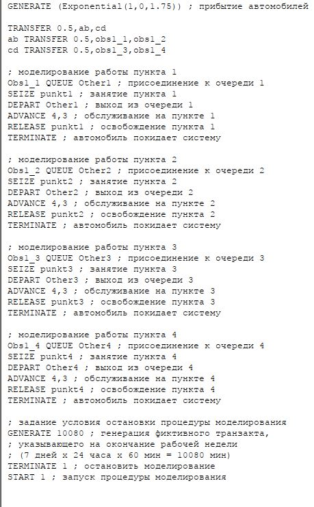{#fig:011 width=70%}

Отчет. В этом случае все критерии выполнены, поэтому 4 пункта являются оптимальным количеством для первой стратегии. (рис. [-@fig:012]).

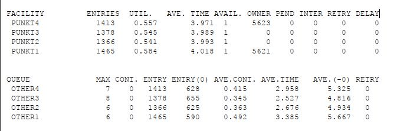{#fig:012 width=70%}

Построим модель для второй стратегии с 4 пропускными пунктами  (рис. [-@fig:013]).

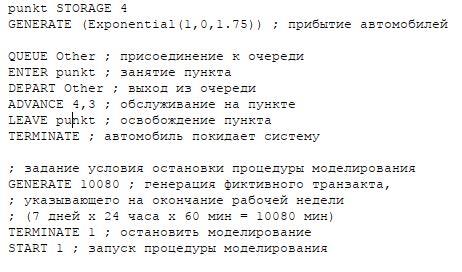{#fig:013 width=70%}

Отчет. Здесь все критерии выполнены при этом время ожидания и среднее число автомобилей меньше, чем в случе второй стратегии с 3 пунктами, однако и загрузка меньше. Можно сделать вывод, что 4 пропускной пункт излишне разгружает систему.

(рис. [-@fig:014]).

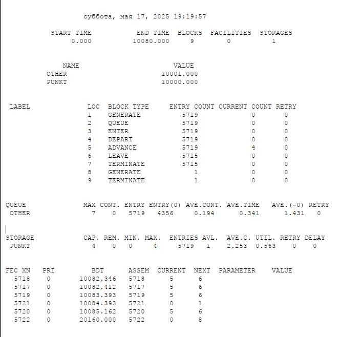{#fig:014 width=70%}

В результате анализа наилучшим количеством пропускных пунктов будет 3 при втором типе обслуживания и 4 при первом.

# Выводы

В результате выполнения данной лабораторной работы я реализовала с помощью gpss:

1. модель с двумя очередями;
2. модель с одной очередью;
3. изменила модели, чтобы определить оптимальное число пропускных пунктов.

# Список литературы{.unnumbered}

::: {#refs}
:::
