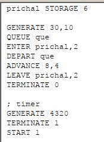

---
## Front matter
title: "Отчёт по лабораторной работе 17"
subtitle: "Задания для самостоятельной работы"
author: "Наталья Андреевна Сидорова"

## Generic otions
lang: ru-RU
toc-title: "Содержание"

## Bibliography
bibliography: bib/cite.bib
csl: pandoc/csl/gost-r-7-0-5-2008-numeric.csl

## Pdf output format
toc: true # Table of contents
toc-depth: 2
lof: true # List of figures
lot: true # List of tables
fontsize: 12pt
linestretch: 1.5
papersize: a4
documentclass: scrreprt
## I18n polyglossia
polyglossia-lang:
  name: russian
  options:
	- spelling=modern
	- babelshorthands=true
polyglossia-otherlangs:
  name: english
## I18n babel
babel-lang: russian
babel-otherlangs: english
## Fonts
mainfont: IBM Plex Serif
romanfont: IBM Plex Serif
sansfont: IBM Plex Sans
monofont: IBM Plex Mono
mathfont: STIX Two Math
mainfontoptions: Ligatures=Common,Ligatures=TeX,Scale=0.94
romanfontoptions: Ligatures=Common,Ligatures=TeX,Scale=0.94
sansfontoptions: Ligatures=Common,Ligatures=TeX,Scale=MatchLowercase,Scale=0.94
monofontoptions: Scale=MatchLowercase,Scale=0.94,FakeStretch=0.9
mathfontoptions:
## Biblatex
biblatex: true
biblio-style: "gost-numeric"
biblatexoptions:
  - parentracker=true
  - backend=biber
  - hyperref=auto
  - language=auto
  - autolang=other*
  - citestyle=gost-numeric
## Pandoc-crossref LaTeX customization
figureTitle: "Рис."
tableTitle: "Таблица"
listingTitle: "Листинг"
lofTitle: "Список иллюстраций"
lotTitle: "Список таблиц"
lolTitle: "Листинги"
## Misc options
indent: true
header-includes:
  - \usepackage{indentfirst}
  - \usepackage{float} # keep figures where there are in the text
  - \floatplacement{figure}{H} # keep figures where there are in the text
---

# Цель работы

Реализовать с помощью gpss модели работы вычислительного центра, аэропорта и морского порта[@lab].

# Задание

Реализовать с помощью gpss[@gpss]:

1. модель работы вычислительного центра;
2. модель работы аэропорта;
3. модель работы морского порта.

# Выполнение лабораторной работы

Моделирование работы вычислительного центра. На вычислительном центре в обработку принимаются три класса заданий А, В и С. Исходя из наличия оперативной памяти ЭВМ задания классов А и В могут решаться одновременно, а задания класса С монополизируют ЭВМ. Задачи класса С загружаются в ЭВМ, если она полностью свободна. Задачи классов А и В могут дозагружаться к решающей задаче.

Смоделируем работу ЭВМ за 80 ч. и определим её загрузку. Код состоит из трех блоков: первые два обрабатывают задания класса A и B, используя один элемент ЭВМ, а третий обрабатывает задания класса C, используя два элемента ЭВМ. Также есть блок времени генерирующий 4800 минут (80 часов). (рис. [-@fig:001]).

{#fig:001 width=70%}

Отчет. Загруженность системы равна 0.994. (рис. [-@fig:002]).

{#fig:002 width=70%}

Модель работы аэропорта. Самолёты прибывают для посадки в район аэропорта каждые 10 ± 5 мин. Если взлетно-посадочная полоса свободна, прибывший самолёт получает разрешение на посадку. Если полоса занята, самолет выполняет полет по кругу и возвращается в аэропорт каждые 5 мин. Если после пятого круга самолет не получает разрешения на посадку, он отправляется на запасной аэродром. В аэропорту через каждые 10 ± 2 мин к взлетно -посадочной полосе выруливают готовые к взлёту самолёты и получают разрешение на взлёт, если полоса свободна. Для взлета и посадки самолёты занимают полосу ровно на 2 мин. Если при свободной полосе одновременно один самолёт прибывает для посадки, а другой -- для взлёта, то полоса предоставляется взлетающей машине.
Требуется:
1. выполнить моделирование работы аэропорта в течение суток;
2. подсчитать количество самолётов, которые взлетели, сели и были направлены на запасной аэродром;
3. определить коэффициент загрузки взлетно-посадочной полосы.
Блок для влетающих самолетов имеет приоритет 2, для прилетающий приоритет 1 (чем выше значение, тем выше приоритет). Происходит проверка: если полоса пустая, то заявка просто отрабатывается, если нет, то происходит переход в блок ожидания. При ожидании заявка проходит в цикле 5 раз, каждый раз проверяется не освободилась ли полоса, если освободилась -- переход в блок обработки, если нет -- самолет обрабатывается дополнительным обработчиком в запасном аэродроме. Время задаем в минутах -- 1440 (24 часа).
 (рис. [-@fig:003]).

{#fig:003 width=70%}

Отчет. Взлетело 142 самолета, село 146, а в запасной аэропорт отправилось 0. В запасной аэропорт не отправились самолеты, поскольку процессы обработки длятся всего 2 минуты, что намного быстрее, чем генерации новых самолетов. Коэффициент загрузки полосы равняется 0.4, полоса большую часть времени не используется. (рис. [-@fig:004]).

{#fig:004 width=70%}

Моделирование работы морского порта. Морские суда прибывают в порт каждые [ α ± δ ] часов. В порту имеется N причалов. Каждый корабль по длине занимает M причалов и находится в порту [ b ± ε ] часов.

Требуется построить GPSS-модель для анализа работы морского порта в течение полугода, определить оптимальное количество причалов для эффективной работы порта.

Рассмотрим два варианта исходных данных:

1.   a = 20 ч, δ = 5 ч, b = 10 ч, ε = 3 ч, N = 10 , M = 3 ;
2.   a = 30 ч, δ = 10 ч, b = 8 ч, ε = 4 ч, N = 6 , M = 2 .

Первый случай. (рис. [-@fig:005]).

{#fig:005 width=70%}

Отчет. При запуске с 10 причалами видно, что судна обрабатываются быстрее, чем успевают приходить новые, так как очередь не набирается. Кроме того загруженность причалов очень низкая.  (рис. [-@fig:006]).

{#fig:006 width=70%}

Моделирование работы морского порта. Первый случай. оптимальное число причалов (рис. [-@fig:007]).

{#fig:007 width=70%}

Отчет. Соответственно, установив наименьшее возможное число причалов -- 3, получаем оптимальный результат (рис. [-@fig:008]).

{#fig:008 width=70%}

Моделирование работы морского порта. Второй случай. (рис. [-@fig:009]).

{#fig:009 width=70%}

Отчет. При запуске с 6 причалами видно, что судна обрабатываются быстрее, чем успевают приходить новые, так как очередь не набирается. Кроме того загруженность причалов очень низкая.  (рис. [-@fig:010]).

{#fig:010 width=70%}

Моделирование работы морского порта. Второй случай. оптимальное число причалов (рис. [-@fig:011]).

{#fig:011 width=70%}

Отчет. Соответственно, установив наименьшее возможное число причалов -- 2, получаем оптимальный результат (рис. [-@fig:012]).

{#fig:012 width=70%}

# Выводы

В результате выполнения данной лабораторной работы я реализовала с помощью gpss:

1. модель работы вычислительного центра;
2. модель работы аэропорта;
3. модель работы морского порта.

# Список литературы{.unnumbered}

::: {#refs}
:::
